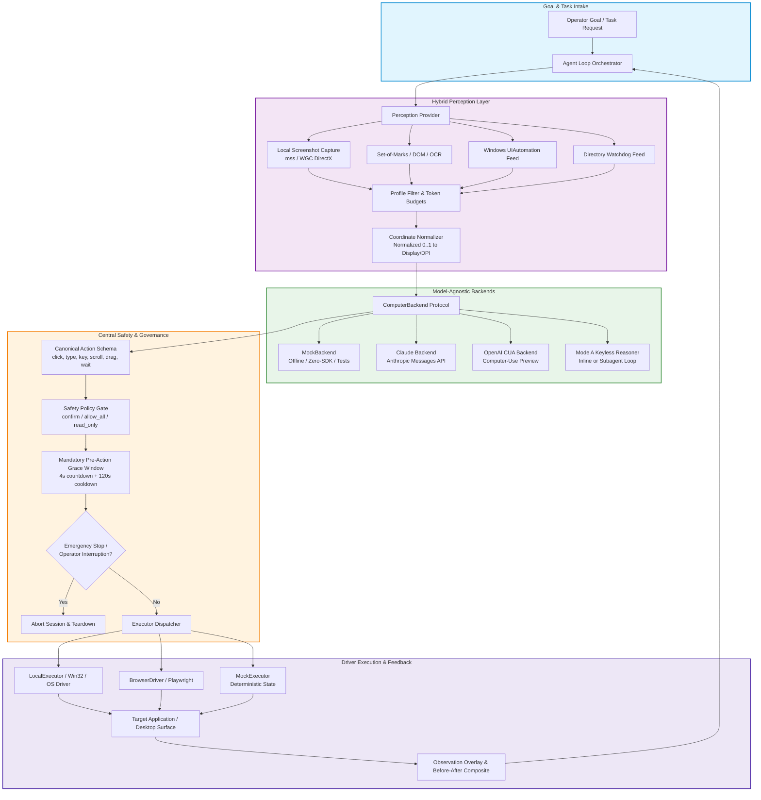
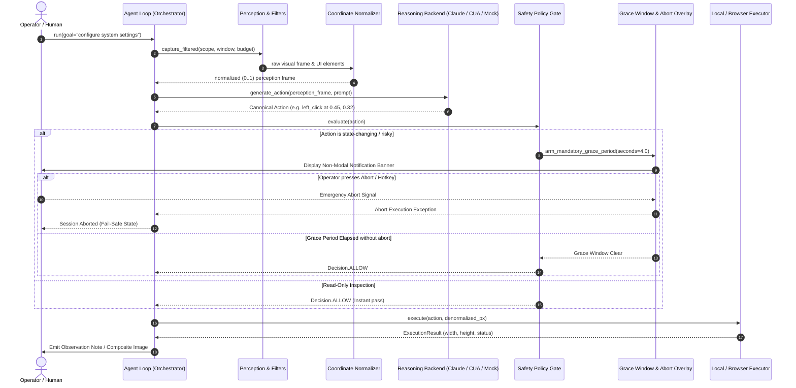

# open-compute


[🇬🇧 English](README.md) | [🇩🇪 Deutsch](README_de.md)

[](CHANGELOG.md)
[](pyproject.toml)
[](https://github.com/ellmos-ai/open-compute/actions/workflows/tests.yml)
[](tests)
[](pyproject.toml)
[](SECURITY.md)
[](SECURITY.md)
[](https://github.com/astral-sh/ruff)
[](llms.txt)
[](THIRD_PARTY_LICENSES.md)
[](https://github.com/ellmos-ai)
[](https://github.com/open-bricks)
[](LICENSE)

**A model-agnostic computer-use core: one agent loop, any reasoning model behind a single interface.**

open-compute is a small, dependency-light Python core for building computer-use
agents (LLM-driven GUI / desktop / browser automation). It implements the
**perception → model-tool-call → action → feedback** loop and keeps the
reasoning model swappable behind a single `ComputerBackend` interface. **No
provider is privileged**: Anthropic Claude and OpenAI CUA are two equally-ranked
API backends, and the offline `mock` backend is the default. A **keyless** path
also exists today via Mode A, where the host model itself reasons — and it can
run that loop either inline or in a self-spawned subagent for context economy
(see [usage pattern](#usage-pattern--inline-a-vs-self-subagent-b)). The core has
**zero runtime dependencies**; vendor SDKs (`anthropic`, `openai`) are
**optional, lazily imported** extras — `import open_compute` works with none of
them installed, and the default mock wiring runs fully offline.

> [!NOTE]
> **AI / LLM Integration Notice**: `open-compute` includes a machine-readable [`llms.txt`](llms.txt) file designed for AI agents, RAG crawlers, and LLM-assisted workflows.

---

## Quick Navigation

- [✨ Highlights & Core Philosophy](#highlights--core-philosophy)
- [🎯 Target Personas & Discoverability](#target-personas--discoverability)
- [📊 Comparative Matrix vs. Alternatives](#comparative-matrix-vs-alternatives)
- [🏗️ System Architecture Flow](#system-architecture-flow)
- [🔄 Agent Loop & Safety Lifecycle](#agent-loop--safety-lifecycle)
- [🛡️ Governance & Runtime Invariants](#governance--runtime-invariants)
- [🌐 Sibling Ecosystem & Partner Repositories](#sibling-ecosystem--partner-repositories)
- [💡 Why open-compute](#why-open-compute)
- [🤖 Supported Backends & Status](#supported-backends--status)
- [📦 Installation & Extras](#installation--extras)
- [🚀 Quick Start & Usage Patterns](#quick-start--usage-patterns)
- [⏱️ Mandatory Pre-Action Grace Window](#mandatory-pre-action-grace-window)
- [🔍 Profile-Filtered Perception & Window Scoping](#profile-filtered-perception--window-scoping)
- [💻 CLI Command Reference](#cli-command-reference)
- [🔒 Security Policy & Vulnerability Reporting](#security-policy--vulnerability-reporting)
- [🧪 Running Tests](#running-tests)
- [📜 Third-Party Licenses & Transparency](#third-party-licenses--transparency)
- [📄 License](#license)

---

## Highlights & Core Philosophy

- 🎯 **True Model-Agnosticism**: Run Claude (Messages API), OpenAI CUA, or deterministic offline mocks without rewriting your orchestration or prompt logic.
- 📐 **Unified Normalized Coordinates (0..1)**: Models output invariant floats `[0.0, 1.0]`. Resolution differences, dual-monitor offsets, and OS DPI scaling factors are resolved centrally in `coordinates.py`.
- 🛡️ **Mandatory Pre-Action Grace Window**: Unconditional 4-second safety window before the first action in any session, empowering operators to interrupt or emergency-abort before any GUI state mutation occurs.
- 🚦 **Centralized Safety Gate**: Configurable policy modes (`confirm`, `allow_all`, `read_only`) intercept every mouse click, keypress, drag, and process execution before it hits the operating system.
- 🔌 **Zero Runtime Dependencies**: Core agent loop and mock executor require only the Python standard library. Vendor SDKs (`anthropic`, `openai`, `mss`, `playwright`) are lazy-loaded extras.
- 🪟 **Semantic Profile-Filtered Perception**: Strict token-bounded GUI window scoping prevents model context bloat and guarantees background windows remain uncaptured.

---

## Why open-compute

Every computer-use model — Anthropic's Claude `computer` tool and OpenAI's
computer-use tool — shares the same agent-loop *shape* but differs in transport,
coordinate frame, and action names. open-compute factors out the common parts so
you write the loop once and swap the reasoning model freely behind one
`ComputerBackend` interface:

- A **canonical action schema** with one mapper per backend.
- **Normalized (0..1) coordinates** internally, denormalized per backend /
  resolution / DPI in one tested utility — the DPI problem solved centrally.
- A **central safety gate** ("confirm before risky actions") evaluated before
  every action.
- A **hybrid perception** interface (screenshot + Set-of-Marks / accessibility /
  DOM), so you can move from pure pixel-vision to semantic targeting later.

---

## Target Personas & Discoverability

`open-compute` is architected to address the operational requirements, privacy boundaries, and precision standards of four primary practitioner personas:

| Persona ID | Target Audience | Primary Need | Key open-compute Architectural Solution |
|---|---|---|---|
| `[PERSONA-01]` | **Enterprise AI Agent Engineers & Platform Architects** | Model-swappable desktop agent core without proprietary vendor lock-in or coordinate fragmentation. | Single `ComputerBackend` protocol, unified canonical `Action` schema (`actions.py`), normalized `[0.0, 1.0]` coordinates (`coordinates.py`), and offline `MockBackend`. |
| `[PERSONA-02]` | **Open-Source Agent Developers & AI Researchers** | Transparent, lightweight core to benchmark perception-action loops without massive Docker images or cloud costs. | Zero mandatory runtime dependencies (pure Python standard library core), deterministic offline test harness, and pluggable hybrid perception feeds. |
| `[PERSONA-03]` | **Security, Safety & Governance Compliance Officers** | Enforcing human-in-the-loop oversight, emergency aborts, and strict zero-telemetry boundaries for GUI execution. | Mandatory 4-second `Pre-Action Grace Window` (`INV-GRC-04`), 3-tier fail-closed safety gate (`INV-SAF-05`), unprivileged user mode (`INV-USR-06`), and 100% offline zero-egress by default (`INV-EGR-07`). |
| `[PERSONA-04]` | **Desktop & GUI Automation Specialists (RPA Modernizers)** | Modernizing brittle pixel-based RPA scripts (PyAutoGUI, AutoHotkey) into robust, semantic LLM-driven actions. | DPI-invariant coordinate rescaling, token-budgeted UIA window scoping (`perception_filter.py`), and native CLI utilities (`oc do`, `oc capture`, `oc click-name`). |

### High-Intent Search Queries & Discoverability

To facilitate rapid technical discovery and natural language indexing across open-source catalogs, package registries, and developer search engines:

- `python computer use agent core` — Lightweight model-agnostic computer-use agent runtime in pure Python.
- `claude computer use alternative python` — Vendor-neutral framework supporting Anthropic Claude, OpenAI CUA, and offline mocks.
- `model agnostic gui automation llm` — Single agent loop for vision-language models driving desktop and browser interfaces.
- `normalized coordinates screen automation` — Resolution- and DPI-invariant coordinate normalization (0..1) for AI screen actions.
- `safe desktop automation agent framework` — Fail-closed safety gate with mandatory 4-second pre-action grace window and operator abort.
- `set of marks gui agent python` — Hybrid perception combining screenshot vision, Set-of-Marks, and Windows UIAutomation trees.

---

## Comparative Matrix vs. Alternatives

The following matrix evaluates `open-compute` against common alternative architectures across 10 technical dimensions directly tied to its formal governance invariants:

| Technical Dimension | Governance Invariant | open-compute | Anthropic Reference Demo (Docker) | OSWorld / Agent-S Benchmark Frameworks | Classical RPA Tools (PyAutoGUI / Selenium) | Ad-Hoc Scripts / Shell Wrappers |
|---|---|:---:|:---:|:---:|:---:|:---:|
| **Model Agnosticism** | `INV-MOD-01` | **Full (Claude, OpenAI CUA, Mock, Mode A)** | Claude Messages API only | Wrapper-based multi-model | None (No LLM reasoning) | None (Hardcoded logic) |
| **Runtime Dependencies** | `INV-DEP-02` | **0 (Pure Python Stdlib Core)** | Heavy Docker + Node + Python | Massive Docker image (>20 GB) | Heavy native C extensions & drivers | System-dependent binaries |
| **Coordinate Normalization** | `INV-CRD-03` | **Unified Normalized 0..1 + central DPI rescaling** | Fixed pixel coordinates (1024x768 etc.) | Pixel-based with scaling drift | Fixed screen pixels (breaks on DPI change) | Hardcoded pixel coordinates |
| **Pre-Action Grace Window** | `INV-GRC-04` | **Mandatory 4s countdown + 120s cooldown + abort latch** | None (Executes immediately) | None (Benchmark execution) | None (Instant execution) | None |
| **Fail-Closed Safety Gate** | `INV-SAF-05` | **3-Tier Policy Gate (`confirm`, `allow_all`, `read_only`)** | Advisory prompt warnings only | None (Unrestricted in VM) | None (Blind execution) | None |
| **Unprivileged Execution** | `INV-USR-06` | **Strict RunAsInvoker (Non-elevated user mode)** | Root in Docker container | Root / Sudo inside virtual machine | Often prompts for Admin elevation | Risk of uncontrolled elevation |
| **Local-First & Zero Egress** | `INV-EGR-07` | **100% Offline by default (0 sockets in mock/local mode)** | Mandatory cloud connection | Network-enabled VM with telemetry | Local execution, but no privacy policy | Script-dependent |
| **Zero Secret Persistence** | `INV-SEC-08` | **Ephemeral in-memory API keys; never saved to disk/logs** | Environment variables in container | Configuration files with embedded tokens | Hardcoded plain-text credentials | Plain text environment or scripts |
| **Semantic Window Scoping** | `INV-SCP-09` | **Token-budgeted UIA filter & background blanking** | Full screen capture only | Full desktop screenshots | Window handle search or full desktop | Naive window focus |
| **Security & SLA Commitment** | `INV-SLA-10` | **Contractual 48h response & 5-day triage SLA** | Best-effort developer preview | Academic repository (issue backlog) | Community forum / commercial tiers | No security or maintenance SLA |

---

## Architecture

### System Architecture Flow



### Agent Loop & Safety Lifecycle



### Component Layout

```
                        +-----------------------------------------+
                        |        AGENT LOOP / ORCHESTRATOR        |
                        |  goal -> perceive -> backend -> safety  |
                        |        -> execute -> re-perceive        |
                        +-------------------+---------------------+
                                            |
        +-----------------------------------+-----------------------------------+
        |                                   |                                   |
+-------v---------+              +----------v-----------+            +----------v----------+
| PERCEPTION      |              | CANONICAL ACTIONS    |            | SAFETY / POLICY     |
| - screenshot    |              | click/type/key/      |            | - confirm-at-action |
| - set-of-marks  |              | scroll/drag/wait/    |            | - allow / deny list |
|   (OmniParser)* |              | screenshot + OS ext  |            | - read-only mode    |
| - accessibility*|              | (launch/activate)    |            | - audit log         |
+-------+---------+              +----------+-----------+            +----------+----------+
        |                                   |                                   |
        +-----------------+-----------------+----------------------------------+
                          |
              +-----------v------------+   COORDINATE / DPI NORMALIZATION
              | BACKEND ABSTRACTION    |   - internal: normalized (0..1)
              | (ComputerBackend)      |   - denormalize per backend:
              +-----+--------+---------+     * Claude: global px (display_w x display_h)
                    |        |    |          * OpenAI: px (computer_call)
        +-----------+        |    +-----------+   * Mock: synthetic
        |                    |                |
+-------v-------+   +--------v-------+  +-----v---------+
| Claude        |   | OpenAI CUA     |  | Mock backend  |
| computer_2025 |   | computer-use-  |  | (no SDK,      |
| 1124 + beta   |   | preview [?]    |  |  offline)     |
| (host runs)   |   | (host runs)    |  |               |
+---------------+   +----------------+  +---------------+

  * = stub / interface in this release (see Status)
```

---

## Governance & Runtime Invariants

The architecture enforces strict operational invariants to guarantee security, repeatability, and non-destructive execution:

| ID | Capability / Invariant | Implementation Mechanism | Safety & Architectural Guarantee |
|:---|:---|:---|:---|
| `INV-MOD-01` | **Model-Agnostic Core** | `ComputerBackend` protocol abstraction | Swap Claude, OpenAI CUA, or offline Mock without rewriting the agent loop. |
| `INV-DEP-02` | **Zero Runtime Dependencies** | Lazy optional imports for SDKs & platform drivers | Pure Python standard library on import; vendor SDKs (`anthropic`, `openai`) are strictly optional. |
| `INV-CRD-03` | **Normalized Coordinates (0..1)** | Central DPI & resolution rescaling in `coordinates.py` | Display-resolution and DPI scaling solved centrally; models always operate in invariant (0..1) space. |
| `INV-GRC-04` | **Mandatory Pre-Action Grace Window** | Unconditional session timer (`pre_action_grace_seconds`) | 4-second delay before first state-changing action allows immediate human interruption / emergency stop. |
| `INV-SAF-05` | **Fail-Closed Safety Gate** | Central `SafetyPolicy` evaluator (`confirm`, `allow_all`, `read_only`) | Potentially destructive actions are blocked by default until human confirmation callback approves them. |
| `INV-USR-06` | **Unprivileged User Mode** | Standard Win32/OS API user permissions | Zero administrative elevation (`RunAsInvoker`); runs safely inside standard user security context. |
| `INV-EGR-07` | **Local-First & Zero Egress** | Offline mock backend & local-first executor default | Core loop never contacts external network services unless configured with an external LLM backend. |
| `INV-SEC-08` | **Zero Secret Persistence** | Environment-based API key injection | API keys and session secrets are never persisted in logs, state files, or screenshots. |
| `INV-SCP-09` | **Profile-Filtered Perception** | Scope filters, visual lenses, and token budgeting | Strict pre-model boundary prevents unintended screen capturing or sensitive window leakage. |
| `INV-SLA-10` | **Security Response SLA** | Dedicated security contact & vulnerability process | 48-hour response acknowledgment and 5 business days triage guarantee via `SECURITY.md`. |

---

## Sibling Ecosystem & Partner Repositories

`open-compute` is designed to operate as the visual and GUI execution engine within the broader **ellmos-ai** and **open-bricks** federated multi-agent automation ecosystem:

| Repository | Role & Specialization | Ecosystem Integration |
|:---|:---|:---|
| [`ellmos-ai/bach`](https://github.com/ellmos-ai/bach) | Orchestration & Multi-Agent Pipelines | Master orchestration framework for autonomous agent workflows. |
| [`ellmos-ai/usmc`](https://github.com/ellmos-ai/usmc) | Universal State Management & Controller | Central system state coordination across distributed agents. |
| [`ellmos-ai/connectors`](https://github.com/ellmos-ai/connectors) | Zero-Dependency Asynchronous Connectors | Protocol adapters for Telegram, Discord, GitHub, and local webhooks. |
| [`ellmos-ai/clutch`](https://github.com/ellmos-ai/clutch) | High-Performance Multi-Agent Clutch | Low-latency IPC routing, handoffs, and process coupling. |
| [`ellmos-ai/companion-for-agy`](https://github.com/ellmos-ai/companion-for-agy) | Desktop Companion & Supervisor | Background session supervisor and indicator overlay for Antigravity. |
| [`ellmos-ai/system-auditor`](https://github.com/ellmos-ai/system-auditor) | Multi-Agent Health Diagnostic Suite | Deep OS, host environment, and process health verification. |
| [`dev-bricks/lock-master`](https://github.com/dev-bricks/lock-master) | Canonical Lock Synchronization | Multi-device file and process concurrency management. |
| [`dev-bricks/ticket-master`](https://github.com/dev-bricks/ticket-master) | Unified Ticket & Issue Dispatch | Cross-repository issue tracking and automated task assignment. |
| [`dev-bricks/automation-master`](https://github.com/dev-bricks/automation-master) | Task Lifecycle Supervisor | Scheduled task orchestration, sidecar monitoring, and heartbeats. |
| [`file-bricks/CloudLockFixer`](https://github.com/file-bricks/CloudLockFixer) | Cloud Lock Resolver & Conflict Repair | Autonomous deadlock resolution for OneDrive and cloud storage. |
| [`open-bricks/.github`](https://github.com/open-bricks/.github) | Umbrella Governance & CI Standards | Global open-source standards, security baseline, and release policies. |

---

## Install

> [!IMPORTANT]
> **Not on PyPI — install from Git.** This project has no PyPI release yet. The
> name `open-compute` on PyPI is taken by an **unrelated** project ("multi-agent
> systems for healthtech"), so a plain `pip install open-compute` installs
> someone else's package. Always install from this repository:

```bash
pip install "git+https://github.com/ellmos-ai/open-compute.git"                        # core only, zero runtime deps
pip install "open-compute[claude] @ git+https://github.com/ellmos-ai/open-compute.git" # + anthropic SDK
```

The same `extra @ git+…` form works for every extra below:

| Extra | Adds |
|---|---|
| `claude` | anthropic SDK |
| `openai` | openai SDK |
| `local` | mss — real Windows screenshots + input |
| `wgc` | WGC fallback for DirectX surfaces (pulls numpy/OpenCV) |
| `compose` | Pillow — Before\|After composite + annotated shots |
| `watch` | watchdog — native FS events for the directory-watch feed |
| `clirec` | external clirec package for `oc rec` workflows |
| `record` | clirec[record] capture backend compatibility |
| `mcp` | mcp SDK — MCP server (console script: `open-compute-mcp`) |
| `dev` | pytest |
| `all` | anthropic, openai, playwright, mss, WGC, Pillow, watchdog, clirec, mcp |

Extras combine as usual, e.g. `open-compute[local,wgc,claude]`. Working from a
clone instead? `pip install -e ".[local,claude]"` from the repository root.

Until `clirec` has a package release, install it directly when using `oc rec`:

```bash
pip install git+https://github.com/ellmos-ai/clirec.git
```

Python 3.10+.

---

## Quick start

### Mode A — No API key: session-agent as reasoner (chat skill)

Run `oc capture` / `oc do` manually from a Claude Code session. The session
model sees the PNG via the Read tool and decides the next action:

```bash
# 1. Install the local extra (Windows only; provides real screenshots + input)
pip install "open-compute[local] @ git+https://github.com/ellmos-ai/open-compute.git"

# 2. Capture a screenshot — saved automatically to _session/ (never loose on Desktop)
oc capture
# -> {"path": ".../_session/0001_20260620_143200.png", "width": 1920, "height": 1080}
# Then: read the PNG with your Read tool to see the screen.

# 3a. Execute one canonical action (single, backwards-compatible)
oc do '{"type":"mouse_move","x":0.5,"y":0.5}' --mode allow_all
oc click-name "Save" --window "Word" --yes  # semantic click, verified window

# 3b. Execute with Before|After composite (Pillow optional)
oc do '{"type":"key","text":"ctrl+s"}' --label "save" --yes
# -> {"result":"executed","action":"key","composite":"_session/0002_save.png"}

# 3c. Execute a batch/macro (JSON array, one call = multiple actions)
oc do '[{"type":"mouse_move","x":0.5,"y":0.5},{"type":"key","text":"tab"}]' --yes
# -> {"result":"batch","count":2,"width":1920,"height":1080}

# 3d. Ensure the target window is in the foreground before acting
oc do '{"type":"key","text":"ctrl+s"}' --ensure-foreground "Word" --yes

# 3e. Save a full-res after-shot + annotated click marker (v0.5, Pillow optional)
oc click-name "Save" --window "Word" --yes --fullres
# -> {"result":"executed",...,"fullres_annotated":"_session/...fullres.png"}

# 3f. Capture only the active window's bounding rect (v0.5, Windows)
oc capture --window "Word"
# -> {"path":"...","width":800,"height":600,"window":"Word","region":{...}}

# 3g. Watch a directory for changes (v0.5)
oc watch-dir ~/Downloads --for 5       # collect 5 s, print JSON events
oc watch-dir ~/Downloads --once        # one-time snapshot diff

# 3h. Explicit companion handoff (mutations need a granted, scoped lease)
oc session companion --owner local-user
oc session request-control --owner agent-a --scope window:42 --ttl 60
oc session grant --lease-id <lease_id-from-previous-output>
oc window minimize --hwnd 42 --yes

# 3i. Bounded, deduplicated window capture (full screen needs explicit opt-in)
oc capture-series --window "Word" --max-frames 8 --stable-frames 2

# 4. Recapture and repeat until done (or read the "composite" After-shot directly).
```

See `SKILL.md` for the full loop protocol, action schema, coordinate guide, and
environment variable reference.

### Paired observe + clipboard workflow

When the human wants to keep the mouse, keyboard, choices and final publishing
actions, use the bundled
[`open-compute-clipboard-companion`](./skills/open-compute-clipboard-companion/SKILL.md)
skill. The agent keeps the blue `OBSERVE` signal visible, reads the current
field, and places only the matching text or verified file path on the host
clipboard. It never clicks, pastes, authenticates or submits in this workflow.

### Work-together mode (spectator + narrow assist)

For a richer three-part paired mode (Ticket T-20260825-767105130), use the
bundled
[`open-compute-work-together`](./skills/open-compute-work-together/SKILL.md)
skill: (1) `note_observation` writes short, plain-language observations to a
small, non-modal, always-on-top notes window (the mirror of `chat`) — a
low-noise view of "what the machine sees" instead of a busy console log — and the answer comes back through `chat`, whose optional
`choices` turn the reply into one click instead of typing; (2)
the clipboard half above, referenced rather than duplicated; (3) a narrowly
scoped **micro-takeover** — after the human has visibly focused a field
themselves, the agent may issue exactly one `type` (optionally preceded by
one confirming `left_click` on that same field) call to fill it, then
returns control immediately, never chaining further actions without a fresh,
visible focus from the human. The activity cooldown from the mandatory
pre-action grace window (see below) already keeps a follow-up micro-takeover
from re-triggering a new wait on its own, with no special-casing needed.

Asking with options instead of a blank field:

```python
chat(
    context="Which hypothesis fits what bothers you here?",
    choices=["The list is too long", "Wrong sort order", "I cannot find the button"],
)
# -> {"chat_message": "Wrong sort order", "choice_index": 1, "screenshot": None}
```

Up to eight options of at most 120 characters each render as one-click
buttons above the usual free-text entry, which stays available — a typed
answer simply comes back with `choice_index: null`.

### Mode B — Autonomous loop with an API backend

The backend is selected by name; `claude` and `openai` are equally supported
(each needs its own key + extra). For a **keyless** path, use Mode A above — the
host model reasons itself, optionally in a self-spawned subagent (see
[usage pattern](#usage-pattern--inline-a-vs-self-subagent-b)).

```bash
# Claude (needs ANTHROPIC_API_KEY + open-compute[local,claude]):
oc run "Find the latest invoice in the Downloads folder" --backend claude --max-steps 15

# OpenAI (needs OPENAI_API_KEY + open-compute[local,openai]):
oc run "Find the latest invoice in the Downloads folder" --backend openai --max-steps 15
```

Or in Python — `get_backend(name, ...)` builds whichever you name; inject your
own executor or use `LocalExecutor`:

```python
from open_compute import AgentLoop, Config, get_backend
from open_compute.drivers.local import LocalExecutor   # Windows; needs mss
from open_compute.safety import SafetyPolicy

executor = LocalExecutor()   # real display + input
config = Config(backend="claude", scope="os",
                display_width=executor.width, display_height=executor.height)
backend = get_backend("claude", executor.width, executor.height, model="claude-opus-4-8")

loop = AgentLoop(
    config,
    backend=backend,
    executor=executor,
    policy=SafetyPolicy(mode="confirm",
                        confirm_callback=lambda a: input(f"run {a.type.value}? [y/N] ") == "y"),
)
loop.run("Find the latest invoice in the Downloads folder")
```

### Offline dry-run (no API key, no display, mock only)

```python
from open_compute import AgentLoop, Config

loop = AgentLoop(Config(backend="mock", safety_mode="allow_all"))
result = loop.run("Open the settings page and enable dark mode")
print(result.done, result.steps)
for trace in result.traces:
    print(trace.index, trace.backend_message, [a.type.value for a in trace.executed])
```

---

## MCP server (native tool-calls, keyless)

Expose the keyless **Mode A** loop to any MCP client as **native tools** — the
client is the reasoner (no API key, model-agnostic). Versus driving `oc` by hand,
a long-lived server keeps **one warm `LocalExecutor`** resident (no Python restart
per action) and returns screenshots as MCP **image** blocks. Windows-only for real
capture/input.

```bash
pip install "open-compute[mcp,local,uia,wgc] @ git+https://github.com/ellmos-ai/open-compute.git"
open-compute-mcp          # stdio server (console script)
```

**Tools (19):** `capture` · `observe_filtered` · `capture_filtered` · `do`
(single or batch canonical actions) · `tree` ·
`click_name` · `invoke` (UIA semantic targeting) · `list_windows` ·
`get_screen_size` · `watch_dir` · `push_status` · `rec_replay` · `signal_show` /
`signal_hide` / `signal_status` / `signal_abort` (human-in-the-loop screen
signal) · `chat` (human-to-model) · `note_observation` (model-to-human,
non-modal notes window) · `talk` (push-to-talk). Coordinates are
normalized 0..1; `list_windows` and `get_screen_size` describe that frame, so the
client can name a window exactly instead of guessing a title substring.

**Profile-filtered perception.** Hosts that need token economy can send one
strict use-case profile to `observe_filtered` and `capture_filtered`. Filtering
happens locally before model delivery: UIA semantics near the declared focus
come first, text/value/element counts have hard budgets, visual escalation is a
bounded lens, and named windows such as a host chat can be blanked where they
overlap that lens. Unknown profile fields, tools or action types fail closed.
`do(profile=...)` also rejects actions outside the same allowlist. Example:

```json
{
  "profileId": "form-cowork-v1",
  "semanticFirst": true,
  "maxElements": 12,
  "maxCharacters": 1200,
  "textLimit": 120,
  "valuePolicy": "focused-only",
  "selectionLimit": 160,
  "focusRadius": 0.18,
  "visualLens": {"width": 400, "height": 400},
  "allowFullscreen": false,
  "excludeElementNameContains": ["Cowork Companion", "ChatGPT", "Claude"],
  "excludeWindowTitleContains": ["Cowork Companion", "ChatGPT", "Claude"],
  "allowedTools": ["observe_filtered", "capture_filtered", "signal_show", "signal_hide", "signal_status", "do"],
  "allowedActionTypes": ["mouse_move", "left_click", "type", "key", "scroll", "wait"]
}
```

**Named modes.** Spelling a profile out on every call made plain `capture` — a
full-HD screenshot — the path of least resistance, so the frugal tools went
unused. `observe_filtered` and `capture_filtered` therefore also take a `mode`
name that pulls a bundled profile; an explicit `profile` still wins.

| Mode | Elements / characters | Image | `do` |
|---|---|---|---|
| `observe-lite` | 8 / 800, focus radius 0.12 | escalation, needs `reason` | no |
| `observe-full` | 12 / 1200, focus radius 0.18 | escalation, needs `reason` | no |
| `act` | 12 / 1200 | no reason needed | yes |

No mode allows a fullscreen grab, and the lens is 400x400 in all three. Measured
on a synthetic 40-element tree: the focus packet is 695 characters in
`observe-lite` and 1,111 in `observe-full`; a 400x400 lens came to 7,495 bytes
against 190,075 for a 1920x1080 screenshot. A selection longer than the budget is
replaced by a digest rather than truncated. The watching modes list `wait` as
their only action type — a placeholder the schema requires and nothing reaches,
because `do` is not among their tools.

**Hardware-composited windows (`wgc` extra).** A GDI grab of a DirectX window —
Roblox Studio, Blender, a GPU-accelerated browser — does not fail; it quietly
returns an **all-black** rectangle. `capture(window=...)` therefore checks the
frame and, when it comes back blank, re-grabs it through Windows.Graphics.Capture.
Install `open-compute[wgc]` for that fallback; without it a black frame is still
returned rather than failing the call. `OC_WGC_WINDOWS` (comma-separated title
substrings) skips the GDI attempt outright for windows known to need WGC.
Note that WGC only produces a frame when the window *redraws*: an idle or
non-capturable window fails fast (bounded, a few seconds) instead of hanging.

**Capture budget (token cost).** A vision model is billed per pixel, so a full-HD
`capture` is by far the most expensive thing this server returns — and every frame
stays in the conversation, so the cost is paid again on each following request.
Because all coordinates here are normalized 0..1, shrinking the image costs
**nothing in control accuracy**; only legibility drops. Three knobs:

| Variable | Effect | Cost of a 1920×1080 grab |
|---|---|---|
| *(unset)* | full resolution | ~1600 tokens |
| `OC_CAPTURE_SCALE=0.5` | halve both edges | ~690 tokens |
| `OC_CAPTURE_MAX_DIM=768` | cap the longest edge | ~440 tokens |
| `OC_CAPTURE_GRAYSCALE=1` | drop colour | payload only — **not** tokens, which follow pixel count alone |

`OC_CAPTURE_SCALE=0.5` is the sweet spot for GUI work: buttons and field borders
stay clearly identifiable, only small body text gets hard to read. Both size knobs
compose (scale first, then the cap), and a failure to shrink never fails the
capture — the original frame is returned instead.

**Safety.** `OC_SAFETY_MODE` is an operator **ceiling** (`confirm` default ·
`read_only` · `allow_all`); a per-call `mode` can only *tighten* it, never loosen it,
so a prompt-injected agent cannot escape a `read_only`/`confirm` server via
`mode="allow_all"`. Because stdio MCP has no server→client confirm callback,
`confirm`/`read_only` return a `needs_confirmation`/`deny` result **without acting**.

**Fail-closed interaction contract (MCP 0.8).** Prefer `invoke`, then
`click_name`; both resolve exact element names first and reject ambiguous or weak
matches. Their results include `match_type`, `score`, and alternatives, and
`exact=true` is available for destructive/external operations. Both require an
issued window descriptor/token. Raw coordinates
through `do` are the last resort. Call `list_windows` and retain its full window
descriptor or `window_token`, then call `capture`/`tree` and retain the returned
`observation_id` (`capture` also calls it `screenshot_id`). Pass both as
`expected_window` and `observation_id` to exactly one coordinate action. The ID
is one-shot: reuse, a changed screenshot/tree, frame drift, focus drift, or a
covered target fails closed. A successful action returns a fresh
`post_action_observation` and reports newly opened/owned-window candidates.

`type`, key actions, and `activate_window` also require an issued window
descriptor/token. Focus is checked immediately before each text segment or key
dispatch; text results report requested/sent character counts and
complete/partial state without echoing cleartext. The optional
`coordinate_frame` argument is retained only as an assertion against the frame
bound to the observation. The CLI keeps its existing explicit
`--expected-window` / `--coordinate-frame` pre-click contract.

For interactive use, run the server with `OC_SAFETY_MODE=allow_all` **in an isolated
VM** and let the client's tool-permission dialog be the human-in-the-loop. Optional
`OC_DENY` (comma-separated action types) is a hard deny list.

**Auto-signal (`OC_SIGNAL_AUTO`).** Set it to a `SessionMode` name (e.g.
`control`) to auto-show the screen-usage *overlay* before an approved
state-changing tool (`do` / `click_name` / `invoke` / `rec_replay`) actuates. It never overrides an already-visible signal
(manual or auto, any mode) and never fires from a gate-blocked call or a
read-only tool. Unset or `off` (the default) disables the *visual* overlay;
an invalid mode name surfaces as `auto_signal_error` in the tool result
instead of failing the call. See `signal_show`/`signal_hide`/`signal_status`
below for the manual controls and `OC_SIGNAL_CONFIG` for per-mode colors.
`OC_SIGNAL_AUTO` only controls whether that overlay is *shown* — since
Ticket T-20260825-540085216 it no longer controls whether the blocking
grace wait below applies; that is unconditional now (see next paragraph).

**Pre-action grace window — mandatory, not opt-in.** Every gate-relevant
call (`do` / `click_name` / `invoke` / `rec_replay` / `capture`) waits out a
configured grace period before its *first* action in a session, whether or
not `signal_show` was ever called and independent of `OC_SIGNAL_AUTO`. This
closes a real bypass (Ticket T-20260825-540085216): previously, a caller
that simply never called `signal_show` skipped the whole window with no
config change at all — an explicit `signal_show` call armed it, but nothing
enforced that call happening first. The purpose of this window is user
protection/transparency, not a model-hurdle it can voluntarily opt out of,
so the wait itself no longer depends on the model's own cooperation.
- **Default 4 seconds** (was 20s before this ticket — found too long).
- **Activity cooldown, default 120 seconds** (`grace_cooldown_seconds`,
  `OC_SIGNAL_GRACE_COOLDOWN_SECONDS`): once a grace window has been waited
  out, further calls within the cooldown window skip a new one — a session
  in continuous use is not interrupted on every single action. `0` disables
  the cooldown (every call waits out the full grace again, the pre-Ticket
  behaviour).
- **The only way to turn the wait off entirely** is `pre_action_grace_seconds: 0`
  in the *canonical* signal config — `OC_SIGNAL_CONFIG` if set, else
  `<package>/_state/signal-config.json` if that file exists, else built-in
  defaults — or the operator-only `OC_SIGNAL_GRACE_SECONDS=0` environment
  override. Neither is something an
  MCP tool call can set: `signal_show` does accept a `config_path` argument
  for pointing at an *alternate* locally-authored file (a legitimate
  operator feature), but a config loaded that way can never make the
  effective wait shorter than the canonical config's own value — it can
  only ever raise it, never lower it below the operator's own floor. If you
  want a shorter/zero wait, edit the canonical config or set the env
  override; a per-call argument cannot do it for you.

An explicit `signal_show` still arms and *shows* the countdown the same way
it always did — the overlay uses a separate static grace color and shows
`Start in N Sekunden`, counting down once per second; at zero it changes
once to the selected mode color. The duration comes from
`pre_action_grace_seconds` (or the higher-precedence
`OC_SIGNAL_GRACE_SECONDS`), never from a UI-only constant. The JSON signal
config also accepts `pre_action_grace_color: [r, g, b]` and the localizable
`pre_action_grace_label` template, which must contain `{seconds}`.
`signal_status` reports `phase`, `countdown_seconds`, current `color`, and an
`accessible_label`. The native window title carries the same semantic text and
emits an accessibility name-change event each second. There is no flashing,
pulsing, or animated color transition, so disabled Windows animations do not
remove information and color is never the only cue. Note that the *mandatory*
wait above blocks even when no overlay happens to be visible (`OC_SIGNAL_AUTO`
unset and `signal_show` never called) — set `OC_SIGNAL_AUTO` too if you also
want the wait to be visible on screen, not just enforced.

**Signal cleanup and leases.** Every overlay has a TTL (`ttl_seconds` or
`OC_SIGNAL_TTL`, default 120 seconds). `do`, `click_name`, `invoke`, and `rec_replay` hide it
at normal turn end and on errors/abort by default; use `keep_signal=true` only
when a visible lease must span calls. Server shutdown also clears it.
`signal_status` reports owner, session, mode, visibility, and expiration.
For explicitly kept auto-signals, `OC_SIGNAL_IDLE_HIDE` supplies an additional
idle countdown: every state-changing tool call re-arms it.
The value is **seconds, default 60**; `0`, an empty value, or `off` disables the
idle countdown, while the hard TTL still applies.
Only an overlay that `OC_SIGNAL_AUTO` put up is subject to the idle countdown;
a manual `signal_show` over an auto-shown overlay takes ownership and cancels
that countdown. Either kind is still removed at the next action turn end unless
`keep_signal=true`. An unusable idle value surfaces as
`signal_idle_hide_error` instead of failing the action.

**Troubleshooting: `do`/`click_name` only ever return `needs_confirmation` and never
act.** That is the `confirm` ceiling working as designed under stdio MCP — there is
no confirm callback, so the server reports instead of acting. Fix for interactive
use: set `"env": {"OC_SAFETY_MODE": "allow_all"}` in the server registration and let
the client's tool-approval dialog gate each action (do **not** auto-allow the
`do`/`click_name`/`invoke` tools there, or you lose that gate). Note that the env
change only takes effect when the server process (re)starts — an already-connected
client keeps the old ceiling until it reconnects.

Client config (via `uvx`, no manual install):

```json
{ "mcpServers": { "open-compute": {
  "command": "uvx",
  "args": ["--from", "open-compute[mcp,local,uia] @ git+https://github.com/ellmos-ai/open-compute.git", "open-compute-mcp"] } } }
```

The snippet above starts in the safe `confirm` ceiling — the server *reports*
actions but does not perform them. To let it act, add
`"env": {"OC_SAFETY_MODE": "allow_all"}` (isolated VM), gated by the client dialog.
An npm launcher (`npx open-compute-mcp`) is also published for parity with Node MCP
servers and is listed in the [Glama MCP directory](https://glama.ai/mcp/servers/ellmos-ai/open-compute-mcp).
The MCP server is the ideal shape for short, inline tasks; for long,
context-heavy runs, still delegate to a self-spawned subagent (see the usage
pattern below) and call these tools inside it.

---

## Backend matrix

| Backend | SDK | Tool / model | Coordinates | Status |
|---|---|---|---|---|
| `mock` | none | scripted, offline | synthetic | Fully implemented (**default backend**) |
| `claude` | `anthropic` (lazy) | `computer` tool `computer_20251124`, beta header `computer-use-2025-11-24`, default model `claude-opus-4-8` | global pixels; host executes | Implemented; tested via injected client |
| `openai` | `openai` (lazy) | computer-use, model `computer-use-preview` *(configurable, `[UNSICHER]`)* | pixels; host executes | Implemented; model name / request shape not fully verified |
| `local` (foreign reasoner) | none | a *different* model as reasoner — local Ollama, or agy / codex / kimi CLIs | host executes | **Separate, low-priority, optional idea** — would be a real new backend with possible capability differences. Not scheduled. |

The keyless / no-API path is **not** a backend row — it is Mode A, where the
**host model itself** reasons (inline, or in a self-spawned subagent for context
economy; see [usage pattern](#usage-pattern--inline-a-vs-self-subagent-b)).

The implemented backends (`mock` / `claude` / `openai`) share one
`ComputerBackend` Protocol and are dispatched by name from `get_backend()`
(`open_compute/backends/factory.py`) — no provider is hard-wired into the loop.
The Claude tool type / beta header pair
is configurable on the backend
(`tool_type=`, `beta_header=`) so you can target the older `computer_20250124`
/ `computer-use-2025-01-24` pair on older models.

### Executor matrix

| Executor | Requires | Platform | Status |
|---|---|---|---|
| `MockExecutor` | none | any | Fully implemented; used in tests and dry-runs |
| `LocalExecutor` | `mss` (`open-compute[local]`), optional WGC fallback (`open-compute[wgc]`) | Windows only | Implemented; `oc capture` live-tested (368 KB PNG at 1920×1080); `oc do mouse_move` live-tested |

---

## Status — what is real vs. stub

**Fully implemented and tested**

- Canonical action schema + `to_claude` / `to_openai` mappers.
- Coordinate normalize / denormalize / rescale.
- Safety policy gate (`confirm` / `allow_all` / `read_only`, deny list,
  confirmation callback, audit log).
- `Config` dataclass + JSON loader.
- Agent loop orchestrator (dry-run via mocks).
- **Headless cooperative core** (`cooperative.py`, `human_activity.py`):
  injectable perceive/stabilize/act/verify ports, scoped lease and
  human/emergency-stop gates, no-replay action IDs, bounded retries,
  screen-prompt-injection blocking, hash-chained sanitized audit, explicit
  retention/deletion and crash cleanup. `GetLastInputInfo` is a single-shot
  adapter tested only with injected callables; no hook or monitor is enabled.
- Backend dispatch via factory + `MockBackend`; Claude backend tested with an
  injected fake client.
- **`LocalExecutor`** (Windows, `open-compute[local]`): real screenshot via mss,
  real mouse/keyboard via ctypes SendInput with VIRTUALDESK + DPI-awareness.
  Optional `open-compute[wgc]` adds a Windows.Graphics.Capture fallback for
  DirectX / hardware-composited surfaces when mss/GDI capture fails. Action
  dispatch for all action types. Live-tested: `oc capture` → PNG 368 KB
  (1920×1080); `oc do mouse_move` → cursor moved.
- **`oc` CLI** (`oc capture` / `oc do` / `oc run`): Mode A (no-key skill loop)
  and Mode B (autonomous AgentLoop with API backend) wired end-to-end.
  - v0.3: `oc capture` defaults to `_session/` (never loose in CWD/Desktop).
  - v0.3: `oc do` accepts JSON arrays (batch/macro) and `--label` for
    automatic Before|After composite screenshots.
  - v0.3: `--ensure-foreground SUBSTR` / `OC_ALWAYS_FOREGROUND` on `oc do`
    and `oc run` for automatic window activation before actions.
  - v0.3: `Config.always_foreground` field + `[compose]` optional extra (Pillow).
- **`SKILL.md`**: loop protocol for the session-agent (Mode A).
- **Multi-feed abstraction** (v0.4, `open_compute/feeds/`): `PerceptionFeed` +
  `Targeter` protocols, `ScreenshotFeed` (pixel), and a runtime feed registry
  (`available_feeds()`) with graceful capability detection.
- **`UiaWindowsFeed`** (v0.4, Windows, `open-compute[uia]`): UIA element-tree
  perception + semantic targeting. `observe()` walks the ControlView tree;
  `resolve()` does exact > prefix > contains disambiguation; `invoke()` does
  click-free activation via InvokePattern → Toggle → SelectionItem →
  LegacyIAccessible fallback. `center_norm` is the exact inverse of
  `LocalExecutor`'s virtual-desktop mapping (round-trip covered by tests,
  incl. negative multi-monitor origin). The full invoke/resolve/coordinate
  logic is unit-tested with `uiautomation` **mocked**; real-OS smoke tests
  (`oc tree`, `oc click-name --mode confirm`, `oc invoke --mode confirm`) were
  run on Windows 11 — see `CHANGELOG.md`.
- **`oc` CLI** (v0.4): `oc tree`, `oc click-name`, `oc invoke` — all routed
  through the Safety gate.
- **`DirwatchFeed`** (v0.5, `open_compute/feeds/dirwatch.py`): directory-watch
  event feed. Monitors configured paths and emits change events (created /
  modified / deleted / moved) into a rolling deque. Two backends: watchdog
  (MIT, native OS events — `open-compute[watch]`) or stdlib polling (always
  available without extras). `available()` always returns `True`.
  `oc watch-dir <path> [--for SECS] [--once]` CLI.
- **Full-res / annotated verification shot** (v0.5): `oc do --fullres` and
  `oc click-name --fullres` save an additional full-resolution after-shot
  alongside the composite. Pillow (optional) annotates the click position with
  a red circle + crosshair. JSON keys: `"fullres"` / `"fullres_annotated"`.
- **`oc capture --window SUBSTR`** (v0.5, Windows): captures only the bounding
  rect of the named window via Win32 `GetWindowRect`. Case-insensitive,
  whitespace-normalized substring match (same convention as `UiaWindowsFeed`).

- **`FeedManager`** (v0.6, `open_compute/feed_manager.py`): dosierte Push-Auto-Injektion.
  Collects available feeds, applies change-detection per cycle (State-Feeds: SHA-256 hash;
  Event-Feeds: rolling window), dispatches to an `InjectorSink`. Dosage modes per feed:
  `full` | `delta` | `notify` | `off`; runtime-adjustable via `set_dosage()`.
  `LocalFileInjector` (working default; writes to `_state/inject_queue/`).
  `BachInjectorAdapter` (stub; see `feed_manager.py` docstring for activation instructions).
  `oc push --status` / `oc push --once` CLI.
- **`LearningManager`** (v0.6, `open_compute/learning.py`): Bandit/Bayes weighting
  (`BetaPrior`), use-case profiles (JSON, warmstart via `apply_profile_to_manager()`),
  and cross-session LESSONS-LEARNED (JSONL). All state in gitignored `_state/`.

**Interface / stub (honest)**

- Browser driver and OS driver are **interfaces only** (no Playwright / CDP /
  host implementation yet).
- Perception providers other than `ScreenshotPerception` and the v0.4 UIA feed
  (Set-of-Marks, OCR, vision overlays, DOM) are **not yet implemented**.
- `BachInjectorAdapter` is a documented stub; `LocalFileInjector` is the working default sink.
- Always-on push daemon (permanent background loop) is **not yet implemented**.
- Live human-input monitoring, ownership-overlay rendering, global emergency
  hotkeys, voice, virtual-display/session control, and any productive wiring of
  the headless cooperative core are **not implemented or activated**.
- `oc rec` is a **lazy compatibility shim** for the external
  [`ellmos-ai/clirec`](https://github.com/ellmos-ai/clirec) package; install
  `clirec` only when recording/replay workflows are needed.
- The UIA feed is **Windows-only**; Linux (AT-SPI) and macOS (AXUIElement)
  accessibility feeds are **open / planned**.
- The OpenAI backend's model name and exact Responses-API request shape are
  **not fully verified** — validate against live OpenAI docs before production.
- The **self-subagent mode (b)** is a **usage pattern** (docs), not new reasoning
  code — see below. A **foreign / local reasoner** (Ollama / agy / codex / kimi)
  is a **separate, low-priority, optional** idea, not implemented.

See `TODO.md` for the full breakdown.

---

## Usage pattern — inline (a) vs. self-subagent (b)

> **Pattern, not a new backend.** Same host model, no API key — only the
> **context budget** differs. Full design in `ARCHITECTURE.md`
> ("Host-Modell-Kontext: Inline (a) vs. Selbst-Subagent (b)").

When the host model (e.g. Claude Code on a subscription) runs the no-key Mode A
loop, it can spend its context two ways — **same model, same vision, same
reasoning**:

- **(a) Inline (today's solution).** The host model runs
  `capture → decide → do → recapture` **in its own context**. Best for
  **short / simple** tasks (a few steps).
- **(b) Self-subagent (concept).** The host model spawns a subagent **of
  itself** (e.g. via a `Task`) that runs the whole loop in the **subagent's**
  context and returns only the **distilled result** ("invoice found at …").
  The **main context stays clean**; it "feels like API" but is the **same
  model** — the win is **context economy, not a reasoning/vision trade-off**.
  Best for **long / repeated / context-heavy** tasks.

**The model decides per task**, exactly like normal subagent delegation. Rough
heuristic: short → inline (a); long / repeated / context-heavy → spawn a
subagent (b).

A **persistent 24h experience-subagent** is an optional variant of (b): a
long-lived self-subagent that takes repeated jobs and reuses accumulated
experience via the existing `learning.py` (`BetaPrior` / use-case profiles /
LESSONS-LEARNED in `_state/`). Experience lives in `_state/` (persistent), not
in the volatile subagent context. (Lessons should carry decay / confidence to
avoid false lessons — a small additive change, not yet implemented.)

> A *different* model as reasoner (local Ollama, or agy / codex / kimi CLIs) is a
> **separate, low-priority, optional** idea — that would be a real new
> `ComputerBackend` with possible capability differences, and is **not** mode (b).

---

## Security Policy & Vulnerability Reporting

Computer-use is powerful. The default `SafetyPolicy` mode is `confirm`: clicks,
typing, key presses, drags, and app launches are blocked unless a confirmation
callback approves them. Recommended practice (mirrors both vendors' guidance):

- Run real backends in an **isolated VM or container**, never your main desktop.
- Keep a **human in the loop**.
- Treat **on-screen content as untrusted** (prompt-injection risk).
- Response SLA: Vulnerability reports acknowledged within **48 hours**.

For reporting instructions, draft advisories, and the full threat model, see [SECURITY.md](SECURITY.md).

---

<!-- BEGIN GENERATED ELLMOS BUNDLE DISCOVERY -->

## Bundles and partners

Generated discovery projection for `module:open-compute` from `catalog:v4-bundles` (`546290dafbaafd810df1d59ef5a3d7183738472b48cd5a8a81f1e8f2b64d852e`).
Target repository visibility: `public`. Bundle manifests remain the membership authority; this section does not install or activate components.
Discovery approval: `public` module-registry record, explicit default-deny bundle allowlist.

### `ellmos-media-production-bundle`

- Bundle recipe visibility: `private`; role: `declared-component`; requirement: `recommended`.
- module partners: `module:ai-media-editor`, `module:report-forge`, `module:web-scraper`.
- skill partners: `skill:textproduction`, `skill:video-transcriber`.

### `ellmos-software-resource-tools-bundle`

- Bundle recipe visibility: `private`; role: `declared-component`; requirement: `recommended`.
- module partners: `module:ApiProber`, `module:clirec`, `module:connectors`, `module:software-endpoint-registry`.
- skill partners: `skill:ai-portable-setup`.

Composition and runtime details are intentionally omitted.

<!-- END GENERATED ELLMOS BUNDLE DISCOVERY -->

---

## Running Tests

```bash
python -X utf8 -m pytest -ra -v
```

Tests are mock-only and require no SDK; `pip install -e ".[dev]"` from a clone
installs pytest. Current full-suite state: **694 passed, 2 skipped** (100% green, 2026-09-12).

---

## Third-Party Licenses & Transparency

`open-compute` commits to complete software supply-chain transparency and zero copyleft contamination:
- **Core Runtime:** Pure Python standard library (zero third-party code required on import).
- **Optional Adapters:** All optional dependencies (`anthropic`, `openai`, `playwright`, `mss`, `Pillow`, `uiautomation`, `windows-capture`, `watchdog`, `clirec`, `mcp`) are distributed under strictly permissive licenses (MIT, Apache-2.0, BSD-3-Clause, HPND, PSFL-2.0).
- **Zero-Egress Assurances:** The offline mock engine never emits network traffic. No tracking, analytics, or telemetry libraries are bundled.

For detailed license attributions, copyright notices, and dependency scopes, see [THIRD_PARTY_LICENSES.md](THIRD_PARTY_LICENSES.md).

---

## License

MIT — see [LICENSE](LICENSE).
