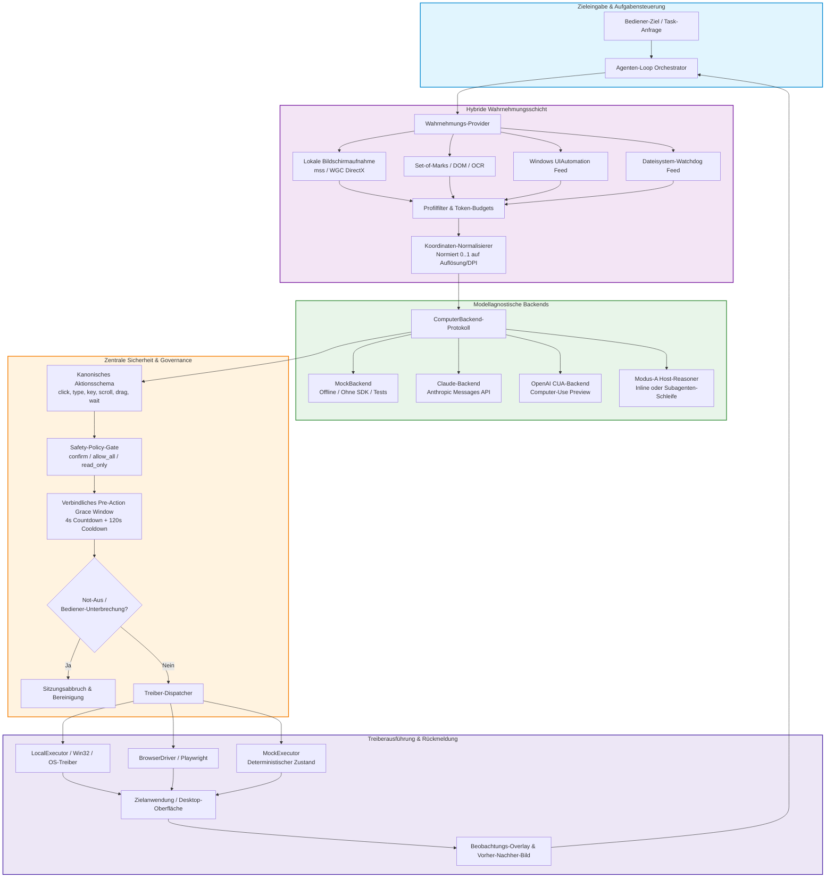
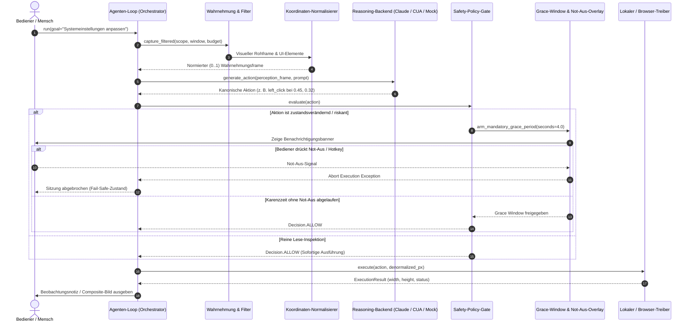

# open-compute


[🇬🇧 English](README.md) | [🇩🇪 Deutsch](README_de.md)

[](CHANGELOG.md)
[](pyproject.toml)
[](https://github.com/ellmos-ai/open-compute/actions/workflows/tests.yml)
[](tests)
[](pyproject.toml)
[](SECURITY.md)
[](SECURITY.md)
[](https://github.com/astral-sh/ruff)
[](llms.txt)
[](THIRD_PARTY_LICENSES.md)
[](https://github.com/ellmos-ai)
[](https://github.com/open-bricks)
[](LICENSE)

**Ein modellagnostischer Computer-Use-Kern: ein Agenten-Loop, jedes Reasoning-Modell hinter einer einzigen Schnittstelle.**

open-compute ist ein kleiner, abhängigkeitsarmer Python-Kern zum Bau von
Computer-Use-Agenten (LLM-gesteuerte GUI-/Desktop-/Browser-Automatisierung). Er
realisiert den Loop **Wahrnehmung → Modell-Tool-Call → Aktion → Rückkopplung**
und hält das Modell hinter einer einzigen `ComputerBackend`-Schnittstelle
austauschbar. **Kein Anbieter ist bevorzugt**: Anthropic Claude und OpenAI CUA
sind zwei gleichrangige API-Backends, und das Offline-`mock`-Backend ist der
Standard. Ein **schlüsselloser** Pfad existiert zudem heute über Modus A, in dem
das Host-Modell selbst das Reasoning übernimmt — und es kann diese Schleife
entweder inline oder in einem selbst gespawnten Subagenten zur Kontext-Ökonomie
ausführen (siehe [Nutzungsmuster](#nutzungsmuster--inline-a-vs-selbst-subagent-b)).
Der Kern hat **keine Laufzeit-Abhängigkeiten**; die Anbieter-SDKs (`anthropic`,
`openai`) sind **optionale, lazy importierte** Extras — `import open_compute`
funktioniert ohne jedes davon, und die Standard-Mock-Verdrahtung läuft
vollständig offline.

> [!NOTE]
> **KI / LLM-Integrationshinweis**: `open-compute` enthält eine maschinenlesbare [`llms.txt`](llms.txt)-Datei für KI-Agenten, RAG-Systeme und LLM-gestützte Entwicklungsworkflows.

---

## Schnellnavigation

- [✨ Highlights & Kernphilosophie](#highlights--kernphilosophie)
- [🎯 Zielgruppen & Auffindbarkeit](#zielgruppen--auffindbarkeit)
- [📊 Vergleichsmatrix gegenüber Alternativen](#vergleichsmatrix-gegenüber-alternativen)
- [🏗️ Systemarchitektur-Ablauf](#systemarchitektur-ablauf)
- [🔄 Agenten-Loop & Sicherheits-Lebenszyklus](#agenten-loop--sicherheits-lebenszyklus)
- [🛡️ Governance & Laufzeit-Invarianten](#governance--laufzeit-invarianten)
- [🌐 Geschwisterwerkzeuge & Partner-Repositories](#geschwisterwerkzeuge--partner-repositories)
- [💡 Warum open-compute](#warum-open-compute)
- [🤖 Unterstützte Backends & Status](#unterstützte-backends--status)
- [📦 Installation & Extras](#installation--extras)
- [🚀 Schnellstart & Nutzungsmuster](#schnellstart--nutzungsmuster)
- [⏱️ Verbindliches Pre-Action Grace Window](#verbindliches-pre-action-grace-window)
- [🔍 Profilgefilterte Wahrnehmung & Fensterfokussierung](#profilgefilterte-wahrnehmung--fensterfokussierung)
- [💻 CLI-Befehlsreferenz](#cli-befehlsreferenz)
- [🔒 Sicherheitsrichtlinie & Meldung von Schwachstellen](#sicherheitsrichtlinie--meldung-von-schwachstellen)
- [🧪 Tests ausführen](#tests-ausführen)
- [📜 Drittanbieter-Lizenzen & Transparenz](#drittanbieter-lizenzen--transparenz)
- [📄 Lizenz](#lizenz)

---

## Highlights & Kernphilosophie

- 🎯 **Echte Modell-Agnostik**: Claude (Messages API), OpenAI CUA oder Offline-Mocks nahtlos ausführen, ohne Orchestrierungslogik oder Prompts anpassen zu müssen.
- 📐 **Einheitliche normierte Koordinaten (0..1)**: Modelle erzeugen koordinatenunabhängige Fließkommazahlen `[0.0, 1.0]`. Unterschiedliche Bildschirmauflösungen, Multi-Monitor-Setups und Betriebssystem-DPI-Skalierungen werden zentral in `coordinates.py` umgerechnet.
- 🛡️ **Verbindliches Pre-Action Grace Window**: Ein bedingungsloses 4-Sekunden-Karenzzeitfenster vor der ersten Aktion jeder Sitzung erlaubt es dem Bediener, jederzeit einzugreifen oder einen Not-Aus-Befehl abzusetzen.
- 🚦 **Zentrales Safety Gate**: Konfigurierbare Sicherheitsmodi (`confirm`, `allow_all`, `read_only`) fangen jeden Mausklick, Tastenanschlag, Drag-Vorgang und Prozessstart ab, bevor er an das Betriebssystem übertragen wird.
- 🔌 **Null Laufzeit-Abhängigkeiten**: Der Basiskern und der Mock-Treiber benötigen ausschließlich die Python-Standardbibliothek. Externe SDKs (`anthropic`, `openai`, `mss`, `playwright`) werden erst bei Bedarf dynamisch geladen.
- 🪟 **Profilgefilterte Fensterwahrnehmung**: Token-begrenzte GUI-Fensterfilter verhindern Kontextüberläufe und garantieren, dass nicht fokussierte Hintergrundfenster niemals erfasst werden.

---

## Warum open-compute

Jedes Computer-Use-Modell — Anthropics Claude-`computer`-Tool und OpenAIs
Computer-Use-Tool — teilt dieselbe *Form* des Agenten-Loops, unterscheidet sich
aber in Transport, Koordinatenrahmen und Aktionsnamen. open-compute zieht die
gemeinsamen Teile heraus, sodass der Loop nur einmal geschrieben wird und das
Reasoning-Modell frei hinter einer `ComputerBackend`-Schnittstelle austauschbar
bleibt:

- Ein **einheitliches Aktions-Schema** mit je einem Mapper pro Backend.
- **Normierte (0..1)-Koordinaten** intern, pro Backend / Auflösung / DPI in
  einer getesteten Utility denormalisiert — das DPI-Problem zentral gelöst.
- Ein **zentrales Safety-Gate** („vor riskanten Aktionen bestätigen"), das vor
  jeder Aktion ausgewertet wird.
- Eine **Hybrid-Wahrnehmung** (Screenshot + Set-of-Marks / Accessibility / DOM),
  damit man später von reiner Pixel-Vision auf semantisches Targeting wechseln
  kann.

---

## Zielgruppen & Auffindbarkeit

`open-compute` wurde entwickelt, um die betrieblichen Anforderungen, Sicherheitsgrenzen und Präzisionsansprüche von vier zentralen Zielgruppen zu erfüllen:

| Persona ID | Zielgruppe | Primärer Bedarf | Zentrale open-compute Lösung |
|---|---|---|---|
| `[PERSONA-01]` | **Enterprise AI Agent Engineers & Plattform-Architekten** | Modell-austauschbarer Desktop-Agenten-Kern ohne Anbieter-Lock-in oder fragmentierte Koordinaten. | Einheitliches `ComputerBackend`-Protokoll, kanonisches Aktionsschema (`actions.py`), normierte `[0.0, 1.0]`-Koordinaten (`coordinates.py`) und Offline-`MockBackend`. |
| `[PERSONA-02]` | **Open-Source-Agenten-Entwickler & KI-Forscher** | Transparenter, leichtgewichtiger Kern zum Benchmarking von Wahrnehmungs-Aktions-Schleifen ohne riesige Docker-Images oder Cloud-Kosten. | Null zwingende Laufzeit-Abhängigkeiten (reine Python-Standardbibliothek im Kern), deterministische Offline-Testumgebung und modular ansteckbare Wahrnehmungs-Feeds. |
| `[PERSONA-03]` | **Sicherheits-, Compliance- & Governance-Beauftragte** | Durchsetzung menschlicher Kontrolle, Not-Aus-Mechanismen und strikter Zero-Telemetrie-Grenzen bei der GUI-Ausführung. | Verbindliches 4-Sekunden `Pre-Action Grace Window` (`INV-GRC-04`), 3-stufiges Fail-Closed-Sicherheits-Gate (`INV-SAF-05`), Ausführung mit minimalen Benutzerrechten (`INV-USR-06`) und standardmäßig 100% offline ohne Netzwerkabfluss (`INV-EGR-07`). |
| `[PERSONA-04]` | **Desktop- & GUI-Automatisierungs-Spezialisten (RPA-Modernisierer)** | Modernisierung anfälliger, pixelbasierter RPA-Skripte (PyAutoGUI, AutoHotkey) zu robusten, semantisch gesteuerten LLM-Aktionen. | DPI-invariante Koordinatenskalierung, token-budgetierte UIA-Fensterfokussierung (`perception_filter.py`) und native CLI-Werkzeuge (`oc do`, `oc capture`, `oc click-name`). |

### High-Intent-Suchbegriffe & Auffindbarkeit

Zur gezielten Auffindbarkeit in Open-Source-Katalogen, Paketregistern und Entwickler-Suchmaschinen:

- `ki desktop automatisierung python framework` — Modellunabhängiges Python-Framework für KI-gestützte Desktop- und GUI-Automatisierung.
- `modellunabhaengige gui agenten steuerung` — Universeller Agenten-Loop für Claude, OpenAI und lokale LLM-Steuerung.
- `sichere desktop ki automatisierung fail closed` — Fail-Closed Sicherheitsarchitektur mit 4-Sekunden Grace Window und Not-Aus.
- `normierte koordinaten bildschirmsteuerung python` — DPI- und auflösungsunabhängige Koordinatennormierung für Vision-Agenten.
- `offline ki agenten loop zero egress` — 100% lokales Agenten-Framework ohne externe Telemetrie oder Cloud-Zwang.
- `set of marks gui agent python` — Hybride Wahrnehmung aus Screenshot-Vision, Set-of-Marks und Windows-UIAutomation-Struktur.

---

## Vergleichsmatrix gegenüber Alternativen

Die folgende Matrix bewertet `open-compute` gegenüber alternativen Ansätzen entlang von 10 technischen Dimensionen, die direkt an die formalen Governance-Invarianten gekoppelt sind:

| Technische Dimension | Governance-Invariante | open-compute | Anthropic Referenz-Demo (Docker) | OSWorld / Agent-S Benchmark-Frameworks | Klassische RPA-Tools (PyAutoGUI / Selenium) | Ad-Hoc-Skripte / Shell-Wrapper |
|---|---|:---:|:---:|:---:|:---:|:---:|
| **Modell-Agnostik** | `INV-MOD-01` | **Vollständig (Claude, OpenAI CUA, Mock, Modus A)** | Nur Claude Messages API | Wrapper-basierte Multi-Modelle | Keine (Kein LLM-Reasoning) | Keine (Hardcodierte Logik) |
| **Laufzeit-Abhängigkeiten** | `INV-DEP-02` | **0 (Reiner Python-Stdlib-Kern)** | Schweres Docker + Node + Python | Massives Docker-Image (>20 GB) | Schwere native C-Erweiterungen & Treiber | Systemabhängige Binärdateien |
| **Koordinaten-Normierung** | `INV-CRD-03` | **Einheitlich normiert 0..1 + zentrale DPI-Skalierung** | Feste Pixelkoordinaten (1024x768 etc.) | Pixel-basiert mit Skalierungsdrift | Feste Pixel (bricht bei DPI-Änderung) | Hardcodierte Pixelkoordinaten |
| **Pre-Action Grace Window** | `INV-GRC-04` | **Verbindlich 4s Countdown + 120s Cooldown + Not-Aus** | Keine (Sofortige Ausführung) | Keine (Benchmark-Ablauf) | Keine (Sofortige Ausführung) | Keine |
| **Fail-Closed Safety Gate** | `INV-SAF-05` | **3-Stufen-Gate (`confirm`, `allow_all`, `read_only`)** | Nur unverbindliche Prompt-Warnungen | Keine (Ungeschützt in VM) | Keine (Blindes Ausführen) | Keine |
| **Unprivilegierte Ausführung** | `INV-USR-06` | **Strikter RunAsInvoker (Einfache Benutzerrechte)** | Root im Docker-Container | Root / Sudo in virtueller Maschine | Fordert oft Admin-Rechte | Gefahr unkontrollierter Rechteausweitung |
| **Lokal-Zentriert & Zero Egress** | `INV-EGR-07` | **100% Offline standardmäßig (0 Sockets im Mock/Lokal)** | Zwingende Cloud-Verbindung | Netzwerkfähige VM mit Telemetrie | Lokale Ausführung, aber keine Datenschutzgarantie | Skriptabhängig |
| **Zero Secret Persistence** | `INV-SEC-08` | **Flüchtige In-Memory API-Keys; nie auf Disk/Logs** | Umgebungsvariablen im Container | Konfigurationsdateien mit Token | Klartext-Zugangsdaten im Code | Klartext in Umgebungsvariablen |
| **Semantische Fensterfokussierung** | `INV-SCP-09` | **Token-budgetierter UIA-Filter & Hintergrund-Ausblendung** | Nur vollständiger Bildschirm | Vollständige Desktop-Screenshots | Fenstersuche oder Vollbild | Naive Fensterfokussierung |
| **Sicherheits- & SLA-Garantie** | `INV-SLA-10` | **Vertraglich 48h Reaktions- & 5 Tage Triage-SLA** | Unverbindliche Entwickler-Preview | Akademisches Repository (Issue-Rückstau) | Community-Forum / Enterprise-Tarife | Keine Sicherheits- oder Wartungs-SLA |

---

## Architektur

### Systemarchitektur-Ablauf



### Agenten-Loop & Sicherheits-Lebenszyklus



### Komponenten-Übersicht

```
                        +-----------------------------------------+
                        |        AGENTEN-LOOP / ORCHESTRATOR      |
                        |  Ziel -> wahrnehmen -> Backend ->       |
                        |  Safety -> ausführen -> neu wahrnehmen  |
                        +-------------------+---------------------+
                                            |
        +-----------------------------------+-----------------------------------+
        |                                   |                                   |
+-------v---------+              +----------v-----------+            +----------v----------+
| WAHRNEHMUNG     |              | KANONISCHE AKTIONEN  |            | SAFETY / POLICY     |
| - Screenshot    |              | click/type/key/      |            | - confirm-at-action |
| - Set-of-Marks  |              | scroll/drag/wait/    |            | - allow/deny-Liste  |
|   (OmniParser)* |              | screenshot + OS-Ext  |            | - read-only-Modus   |
| - Accessibility*|              | (launch/activate)    |            | - Audit-Log         |
+-------+---------+              +----------+-----------+            +----------+----------+
        |                                   |                                   |
        +-----------------+-----------------+----------------------------------+
                          |
              +-----------v------------+   KOORDINATEN-/DPI-NORMALISIERUNG
              | BACKEND-ABSTRAKTION    |   - intern: normiert (0..1)
              | (ComputerBackend)      |   - pro Backend denormalisieren:
              +-----+--------+---------+     * Claude: globale px (display_w x display_h)
                    |        |    |          * OpenAI: px (computer_call)
        +-----------+        |    +-----------+   * Mock: synthetisch
        |                    |                |
+-------v-------+   +--------v-------+  +-----v---------+
| Claude        |   | OpenAI CUA     |  | Mock-Backend  |
| computer_2025 |   | computer-use-  |  | (kein SDK,    |
| 1124 + Beta   |   | preview [?]    |  |  offline)     |
| (Host führt   |   | (Host führt    |  |               |
|  aus)         |   |  aus)          |  |               |
+---------------+   +----------------+  +---------------+

  * = Stub / Interface in dieser Version (siehe Status)
```

---

## Governance & Laufzeit-Invarianten

Die Architektur erzwingt strikte Betriebsinvarianten, um Sicherheit, Wiederholbarkeit und beschädigungsfreie Ausführung zu gewährleisten:

| ID | Eigenschaft / Invariante | Realisierungsmechanismus | Sicherheits- & Architektur-Garantie |
|:---|:---|:---|:---|
| `INV-MOD-01` | **Modellagnostischer Kern** | `ComputerBackend`-Protokollabstraktion | Nahtloser Wechsel zwischen Claude, OpenAI CUA oder Offline-Mock ohne Änderung des Agenten-Loops. |
| `INV-DEP-02` | **Null Laufzeit-Abhängigkeiten** | Lazy-Imports für Anbieter-SDKs und Plattform-Treiber | Reines Python-Standardbibliotheks-Verhalten beim Import; Vendor-SDKs (`anthropic`, `openai`) sind rein optional. |
| `INV-CRD-03` | **Normierte Koordinaten (0..1)** | Zentrale Skalierung in `coordinates.py` | DPI- und Auflösungsunabhängigkeit zentral garantiert; Modelle operieren stets im normierten (0..1)-Raum. |
| `INV-GRC-04` | **Verbindliches Grace Window** | Bedingungsloser Session-Timer (`pre_action_grace_seconds`) | 4 Sekunden Vorlaufzeit vor der ersten zustandsverändernden Aktion für zuverlässigen Not-Aus-Eingriff. |
| `INV-SAF-05` | **Fail-Closed Safety Gate** | Zentraler `SafetyPolicy`-Evaluator (`confirm`, `allow_all`, `read_only`) | Potenzielle zerstörerische Aktionen sind standardmäßig blockiert bis zur menschlichen Bestätigung. |
| `INV-USR-06` | **Nicht-privilegierter User-Modus** | Standard-Betriebssystem-Berechtigungen | Keine administrativen Rechte erforderlich (`RunAsInvoker`); Ausführung erfolgt im normalen Benutzerkontext. |
| `INV-EGR-07` | **Lokal-Zentriert & Zero Egress** | Offline-Mock-Backend & lokaler Executor als Standard | Der Kern kontaktiert keine externen Dienste, sofern nicht explizit ein Remote-LLM gewählt wird. |
| `INV-SEC-08` | **Null Geheimnis-Persistierung** | Umgebungsvariablen-Injektion | API-Schlüssel werden niemals in Logdateien, Sitzungs-Dumps oder Screenshots gespeichert. |
| `INV-SCP-09` | **Profilgefilterte Wahrnehmung** | Scope-Filter, visuelle Linsen und Token-Budgets | Strikte Filtergrenzen vor der Modellübertragung verhindern das Auslesen fremder Hintergrundfenster. |
| `INV-SLA-10` | **Sicherheits-Reaktions-SLA** | Dedizierte Sicherheitskontakte & Meldeprozess | 48-Stunden-Reaktionszeit und 5-Werktage-Triage-Zusage gemäß `SECURITY.md`. |

---

## Geschwisterwerkzeuge & Partner-Repositories

`open-compute` fungiert als visuelle und funktionale GUI-Ausführungseinheit innerhalb des föderierten Automations-Ökosystems von **ellmos-ai** und **open-bricks**:

| Repository | Rolle & Spezialisierung | Ökosystem-Integration |
|:---|:---|:---|
| [`ellmos-ai/bach`](https://github.com/ellmos-ai/bach) | Orchestrierung & Multi-Agenten-Pipelines | Übergeordnetes Orchestrierungsframework für autonome Workflows. |
| [`ellmos-ai/usmc`](https://github.com/ellmos-ai/usmc) | Universal State Management & Controller | Zentrale Systemzustandskoordination über verteilte Agenten hinweg. |
| [`ellmos-ai/connectors`](https://github.com/ellmos-ai/connectors) | Abhängigkeitsfreie asynchrone Konnektoren | Protokolladapter für Telegram, Discord, GitHub und lokale Webhooks. |
| [`ellmos-ai/clutch`](https://github.com/ellmos-ai/clutch) | Hochleistungs-Kupplung für Multi-Agenten | Latenzarme IPC-Weiterleitung, Handoffs und Prozesskopplung. |
| [`ellmos-ai/companion-for-agy`](https://github.com/ellmos-ai/companion-for-agy) | Desktop-Begleiter & Supervisor | Hintergrundüberwachung und Indikator-Overlay für Antigravity. |
| [`ellmos-ai/system-auditor`](https://github.com/ellmos-ai/system-auditor) | Diagnose-Suite für Multi-Agenten | Tiefgehende Betriebssystem-, Host- und Prozessgesundheitsprüfung. |
| [`dev-bricks/lock-master`](https://github.com/dev-bricks/lock-master) | Kanonische Lock-Synchronisation | Geräteübergreifende Datei- und Prozesssperren-Verwaltung. |
| [`dev-bricks/ticket-master`](https://github.com/dev-bricks/ticket-master) | Einheitliche Ticket- & Vorgangssteuerung | Repository-übergreifendes Issue-Tracking und Aufgabenverteilung. |
| [`dev-bricks/automation-master`](https://github.com/dev-bricks/automation-master) | Aufgaben-Lebenszyklus-Supervisor | Zeitgesteuerte Orchestrierung, Sidecar-Überwachung und Heartbeats. |
| [`file-bricks/CloudLockFixer`](https://github.com/file-bricks/CloudLockFixer) | Cloud-Lock-Behebung & Konfliktreparatur | Autonome Behebung von Deadlocks in OneDrive und Cloud-Speichern. |
| [`open-bricks/.github`](https://github.com/open-bricks/.github) | Dachorganisation & Governance-Standards | Zentrale Open-Source-Richtlinien, Sicherheitsstandards und Policies. |

---

## Installation

> [!IMPORTANT]
> **Nicht auf PyPI — Installation über Git.** Dieses Projekt hat noch kein
> PyPI-Release. Der Name `open-compute` ist dort von einem **fremden** Projekt
> belegt („multi-agent systems for healthtech"); ein schlichtes
> `pip install open-compute` installiert also ein anderes Paket. Immer aus
> diesem Repository installieren:

```bash
pip install "git+https://github.com/ellmos-ai/open-compute.git"                        # nur Kern, keine Laufzeit-Abhängigkeiten
pip install "open-compute[claude] @ git+https://github.com/ellmos-ai/open-compute.git" # + anthropic-SDK
```

Dieselbe `extra @ git+…`-Form gilt für jedes Extra:

| Extra | Ergänzt |
|---|---|
| `claude` | anthropic-SDK |
| `openai` | openai-SDK |
| `local` | mss — echter Windows-Screenshot + Input |
| `wgc` | WGC-Fallback für DirectX-Flächen (zieht numpy/OpenCV) |
| `compose` | Pillow — Vorher\|Nachher-Composite + annotierter Shot |
| `watch` | watchdog — native FS-Events für den Directory-Watch-Feed |
| `clirec` | externes clirec-Paket für `oc rec`-Workflows |
| `record` | clirec[record]-Capture-Backend-Kompatibilität |
| `mcp` | mcp-SDK — MCP-Server (Console-Script: `open-compute-mcp`) |
| `dev` | pytest |
| `all` | anthropic, openai, playwright, mss, WGC, Pillow, watchdog, clirec, mcp |

Extras lassen sich kombinieren, z. B. `open-compute[local,wgc,claude]`. Aus
einem Klon heraus: `pip install -e ".[local,claude]"` im Wurzelverzeichnis.

Bis `clirec` als Paket veröffentlicht ist, für `oc rec` direkt installieren:

```bash
pip install git+https://github.com/ellmos-ai/clirec.git
```

Python 3.10+.

---

## Schnellstart

### Modus A — Ohne API-Key: Session-Agent als Reasoner (Chat-Skill)

`oc capture` / `oc do` werden manuell aus einer Claude-Code-Session aufgerufen.
Das Session-Modell sieht die PNG über das Read-Tool und entscheidet die nächste
Aktion:

```bash
# 1. Lokales Extra installieren (Windows; Screenshot + Input)
pip install "open-compute[local] @ git+https://github.com/ellmos-ai/open-compute.git"

# 2. Screenshot aufnehmen — landet automatisch in _session/ (nie lose auf dem Desktop)
oc capture
# -> {"path": ".../_session/0001_20260620_143200.png", "width": 1920, "height": 1080}
# Dann: Lies das PNG mit deinem Read-Tool, um den Bildschirm zu sehen.

# 3a. Einzelne Aktion ausführen (Safety-Gate: confirm als Default)
oc do '{"type":"mouse_move","x":0.5,"y":0.5}' --mode allow_all
oc click-name "Speichern" --window "Word" --yes  # semantisch + Fensterprüfung

# 3b. Aktion mit automatischem Vorher|Nachher-Composite
oc do '{"type":"key","text":"ctrl+s"}' --label "speichern" --yes
# -> {"result":"executed","action":"key","composite":"_session/0002_speichern.png"}

# 3c. Batch/Makro: mehrere Aktionen in einem Aufruf (JSON-Array)
oc do '[{"type":"mouse_move","x":0.5,"y":0.5},{"type":"key","text":"tab"}]' --yes
# -> {"result":"batch","count":2,"width":1920,"height":1080}

# 3d. Fenster-Vordergrund vor der Aktion sicherstellen
oc do '{"type":"key","text":"ctrl+s"}' --ensure-foreground "Word" --yes

# 3e. Voll-Res-After-Shot + annotierter Klick-Marker (v0.5, Pillow optional)
oc click-name "Speichern" --window "Word" --yes --fullres
# -> {"result":"executed",...,"fullres_annotated":"_session/...fullres.png"}

# 3f. Nur Fenster-Bereich capturen (v0.5, Windows)
oc capture --window "Word"
# -> {"path":"...","width":800,"height":600,"window":"Word","region":{...}}

# 3g. Verzeichnis auf Änderungen überwachen (v0.5)
oc watch-dir ~/Downloads --for 5       # 5 Sekunden Events sammeln, JSON ausgeben
oc watch-dir ~/Downloads --once        # einmaliger Snapshot-Diff

# 3h. Explizite Companion-Übergabe (Mutationen brauchen einen erteilten Scope-Lease)
oc session companion --owner local-user
oc session request-control --owner agent-a --scope window:42 --ttl 60
oc session grant --lease-id <lease_id-aus-vorheriger-ausgabe>
oc window minimize --hwnd 42 --yes

# 3i. Begrenzte, deduplizierte Fenster-Capture-Serie
oc capture-series --window "Word" --max-frames 8 --stable-frames 2

# 4. Neuen Screenshot aufnehmen, wiederholen bis fertig.
#    Alternativ: After-Shot direkt aus dem Composite lesen → ein Roundtrip weniger.
```

Vollständiges Loop-Protokoll, Aktions-Schema, Koordinaten-Leitfaden und
Umgebungsvariablen: `SKILL.md`.

### Gemeinsames Beobachten mit Zwischenablage

Wenn der Mensch Maus, Tastatur, Auswahl und den letzten Veröffentlichungsschritt
behalten möchte, nutze den mitgelieferten Skill
[`open-compute-clipboard-companion`](./skills/open-compute-clipboard-companion/SKILL.md).
Der Agent hält das blaue `OBSERVE`-Signal sichtbar, erkennt das aktuelle Feld
und legt nur den passenden Text oder einen verifizierten Dateipfad in die
Zwischenablage. In diesem Ablauf klickt er nicht, fügt nicht ein, authentifiziert
sich nicht und reicht nichts ein.

### Work-Together-Modus (Zuschauer + eng begrenzte Mikro-Übernahme)

Für einen umfassenderen, dreiteiligen gemeinsamen Modus (Ticket
T-20260825-767105130) den mitgelieferten Skill
[`open-compute-work-together`](./skills/open-compute-work-together/SKILL.md)
nutzen: (1) `note_observation` schreibt kurze, allgemeinverständliche
Beobachtungen in ein kleines, nicht-modales, immer-oben-liegendes
Notizfenster (das Gegenstück zu `chat`) — ein rauschfreier Blick auf „was
sieht die Maschine" statt eines vollen Konsolenlogs; die Antwort kommt über
`chat` zurück, dessen optionale `choices` aus dem Tippen einen Klick machen;
(2) die Zwischenablage-
Hälfte von oben, referenziert statt neu gebaut; (3) eine eng begrenzte
**Mikro-Übernahme** — nachdem der Mensch selbst sichtbar ein Feld
fokussiert hat, darf der Agent genau einen `type`-Aufruf (optional mit
einem vorherigen, bestätigenden `left_click` auf dasselbe Feld) ausführen,
um es zu befüllen, und gibt sofort zurück — nie eine Kette weiterer
Aktionen ohne neue, sichtbare Fokussierung durch den Menschen. Der
Aktivitäts-Cooldown des pflichtigen Vorlauf-Fensters (siehe unten) sorgt
dabei bereits von selbst dafür, dass eine folgende Mikro-Übernahme kein
neues Wartefenster auslöst — ohne dass dieser Skill dafür eine eigene
Ausnahme bräuchte.

Fragen mit Auswahl statt leerem Feld:

```python
chat(
    context="Welche Hypothese trifft es?",
    choices=["Die Liste ist zu lang", "Falsche Sortierung", "Ich finde den Knopf nicht"],
)
# -> {"chat_message": "Falsche Sortierung", "choice_index": 1, "screenshot": None}
```

Bis zu acht Optionen à höchstens 120 Zeichen erscheinen als 1-Klick-Knöpfe
über dem gewohnten Freitextfeld, das erhalten bleibt — eine getippte Antwort
kommt einfach mit `choice_index: null` zurück.

### Modus B — Autonomer Loop mit einem API-Backend

Das Backend wird über den Namen gewählt; `claude` und `openai` sind
gleichrangig unterstützt (jedes braucht eigenen Key + Extra). Für einen
**schlüssellosen** Pfad Modus A oben nutzen — das Host-Modell macht das
Reasoning selbst, optional in einem selbst gespawnten Subagenten (siehe
[Nutzungsmuster](#nutzungsmuster--inline-a-vs-selbst-subagent-b)).

```bash
# Claude (benötigt ANTHROPIC_API_KEY + open-compute[local,claude]):
oc run "Finde die neueste Rechnung im Downloads-Ordner" --backend claude --max-steps 15

# OpenAI (benötigt OPENAI_API_KEY + open-compute[local,openai]):
oc run "Finde die neueste Rechnung im Downloads-Ordner" --backend openai --max-steps 15
```

Oder in Python — `get_backend(name, ...)` baut das benannte Backend:

```python
from open_compute import AgentLoop, Config, get_backend
from open_compute.drivers.local import LocalExecutor   # Windows; benötigt mss
from open_compute.safety import SafetyPolicy

executor = LocalExecutor()
config = Config(backend="claude", scope="os",
                display_width=executor.width, display_height=executor.height)
backend = get_backend("claude", executor.width, executor.height, model="claude-opus-4-8")

loop = AgentLoop(
    config,
    backend=backend,
    executor=executor,
    policy=SafetyPolicy(mode="confirm",
                        confirm_callback=lambda a: input(f"{a.type.value} ausführen? [j/N] ") == "j"),
)
loop.run("Finde die neueste Rechnung im Downloads-Ordner")
```

### Offline-Trockenlauf (kein API-Key, kein Display, nur Mock)

```python
from open_compute import AgentLoop, Config

loop = AgentLoop(Config(backend="mock", safety_mode="allow_all"))
result = loop.run("Öffne die Einstellungen und aktiviere den Dunkelmodus")
print(result.done, result.steps)
for trace in result.traces:
    print(trace.index, trace.backend_message, [a.type.value for a in trace.executed])
```

---

## MCP-Server (native Tool-Calls, schlüssellos)

Stellt die schlüssellose **Modus-A**-Schleife jedem MCP-Client als **native Tools**
bereit — der Client ist der Reasoner (kein API-Key, modellagnostisch). Gegenüber dem
manuellen `oc`-Betrieb hält ein langlebiger Server **einen warmen `LocalExecutor`**
resident (kein Python-Neustart pro Aktion) und liefert Screenshots als MCP-**Bild**-
Blöcke zurück. Für echtes Capture/Input Windows-only.

```bash
pip install "open-compute[mcp,local,uia,wgc] @ git+https://github.com/ellmos-ai/open-compute.git"
open-compute-mcp          # stdio-Server (Console-Script)
```

**Tools (19):** `capture` · `observe_filtered` · `capture_filtered` · `do`
(Einzel- oder Batch-Aktionen) · `tree` · `click_name` ·
`invoke` (semantisches UIA-Zielen) · `list_windows` · `get_screen_size` ·
`watch_dir` · `push_status` · `rec_replay` · `signal_show` / `signal_hide` /
`signal_status` / `signal_abort` (Human-in-the-Loop-Bildschirmsignal) ·
`chat` (Mensch→Modell) · `note_observation` (Modell→Mensch, nicht-modales
Notizfenster) · `talk` (Push-to-Talk). Koordinaten normiert 0..1;
`list_windows` und `get_screen_size` beschreiben genau diesen Rahmen — der Client
kann ein Fenster damit exakt benennen, statt einen Titel zu raten.

**Profilgefilterte Wahrnehmung.** Hosts mit Fokus auf Tokenökonomie geben
`observe_filtered` und `capture_filtered` ein striktes Einsatzprofil mit. Die
Filterung läuft lokal vor der Modellzustellung: UIA-Semantik nahe dem erklärten
Fokus kommt zuerst, Text/Werte/Elemente haben harte Budgets, visuelle Eskalation
bleibt eine begrenzte Linse und benannte Fenster wie ein Host-Chat werden in der
Linse ausgeblendet. Unbekannte Profilfelder, Tools oder Aktionstypen scheitern
geschlossen. Auch `do(profile=...)` weist Aktionen außerhalb derselben
Allowlist zurück. Beispiel:

```json
{
  "profileId": "form-cowork-v1",
  "semanticFirst": true,
  "maxElements": 12,
  "maxCharacters": 1200,
  "textLimit": 120,
  "valuePolicy": "focused-only",
  "selectionLimit": 160,
  "focusRadius": 0.18,
  "visualLens": {"width": 400, "height": 400},
  "allowFullscreen": false,
  "excludeElementNameContains": ["Cowork Companion", "ChatGPT", "Claude"],
  "excludeWindowTitleContains": ["Cowork Companion", "ChatGPT", "Claude"],
  "allowedTools": ["observe_filtered", "capture_filtered", "signal_show", "signal_hide", "signal_status", "do"],
  "allowedActionTypes": ["mouse_move", "left_click", "type", "key", "scroll", "wait"]
}
```

**Hardware-komponierte Fenster (`wgc`-Extra).** Ein GDI-Grab eines DirectX-Fensters —
Roblox Studio, Blender, ein GPU-beschleunigter Browser — schlägt nicht fehl; es
liefert still ein **komplett schwarzes** Rechteck. `capture(window=...)` prüft das
Bild deshalb und holt es bei einem leeren Frame erneut über Windows.Graphics.Capture.
Dafür `open-compute[wgc]` installieren; ohne das Extra wird der schwarze Frame
zurückgegeben, statt den Call scheitern zu lassen. `OC_WGC_WINDOWS`
(kommagetrennte Titel-Teilstrings) überspringt den GDI-Versuch für Fenster, die
bekanntermaßen WGC brauchen. WGC liefert nur ein Bild, wenn das Fenster **neu
zeichnet**: ein untätiges oder nicht erfassbares Fenster scheitert schnell
(zeitlich begrenzt), statt zu hängen.

**Aufnahme-Budget (Token-Kosten).** Ein Vision-Modell rechnet pro Pixel ab — eine
Full-HD-`capture` ist damit das mit Abstand teuerste, was dieser Server zurückgibt.
Und jedes Bild bleibt im Gesprächsverlauf, wird also bei jeder weiteren Anfrage
erneut bezahlt. Da hier alle Koordinaten normalisiert sind (0..1), kostet das
Verkleinern **nichts an Steuergenauigkeit**; nur die Lesbarkeit sinkt. Drei Schalter:

| Variable | Wirkung | Kosten einer 1920×1080-Aufnahme |
|---|---|---|
| *(nicht gesetzt)* | volle Auflösung | ~1600 Token |
| `OC_CAPTURE_SCALE=0.5` | beide Kanten halbieren | ~690 Token |
| `OC_CAPTURE_MAX_DIM=768` | längste Kante deckeln | ~440 Token |
| `OC_CAPTURE_GRAYSCALE=1` | Farbe weglassen | nur Dateigröße — **keine** Token-Ersparnis, die hängt allein an der Pixelzahl |

`OC_CAPTURE_SCALE=0.5` ist der Richtwert für GUI-Arbeit: Schaltflächen und
Feldränder bleiben klar erkennbar, nur kleiner Fließtext wird schwer lesbar. Beide
Größen-Schalter greifen nacheinander (erst Skalierung, dann Deckelung), und ein
fehlgeschlagenes Verkleinern lässt die Aufnahme nie scheitern — dann kommt das
Originalbild zurück.

**Sicherheit.** `OC_SAFETY_MODE` ist eine Operator-**Obergrenze** (`confirm` Standard
· `read_only` · `allow_all`); ein per-Call-`mode` kann sie nur *verschärfen*, nie
lockern — ein prompt-injizierter Agent kann einen `read_only`/`confirm`-Server nicht
via `mode="allow_all"` umgehen. Da stdio-MCP keinen Server→Client-Confirm-Callback
hat, geben `confirm`/`read_only` ein `needs_confirmation`/`deny` **ohne auszuführen**
zurück.

**Fail-closed-Interaktionsvertrag (MCP 0.8).** Nutze zuerst `invoke`, danach
`click_name`: Beide wählen exakte Elementnamen zuerst und weisen mehrdeutige oder
zu schwache Treffer ab. Die Rückgabe enthält `match_type`, `score` und relevante
Alternativen; für destruktive oder externe Aktionen ist `exact=true` verfügbar.
Beide verlangen einen ausgegebenen Fensterdeskriptor oder Token.
Rohe Koordinaten über `do` sind nur der letzte Ausweg. Bewahre zunächst den
vollständigen Fensterdeskriptor oder `window_token` aus `list_windows` auf. Rufe
dann `capture` oder `tree` auf und übergib deren `observation_id` zusammen mit
`expected_window` an genau eine Koordinatenaktion. `capture` bezeichnet dieselbe
ID zusätzlich als `screenshot_id`. Wiederverwendung, veränderte Aufnahme/Baum,
Frame- oder Fokuswechsel und verdeckte Ziele werden abgewiesen. Eine erfolgreiche
Aktion liefert eine neue `post_action_observation` und meldet neue beziehungsweise
zugehörige Fensterkandidaten.

Auch `type`, Tastaturaktionen und `activate_window` verlangen einen ausgegebenen
Fensterdeskriptor oder Token. Vor jedem Textsegment beziehungsweise Tastendruck
wird der Fokus erneut geprüft. Textergebnisse melden angeforderte und gesendete
Zeichenzahl sowie vollständig/teilweise, ohne Klartext zurückzugeben. Das optionale
`coordinate_frame` dient nur noch als Gleichheitsprüfung gegen den an die
Observation gebundenen Frame. Die CLI behält ihren expliziten Vorabvertrag über
`--expected-window` und `--coordinate-frame`.

Für interaktiven Betrieb den Server mit `OC_SAFETY_MODE=allow_all` **in einer
isolierten VM** starten und den Tool-Berechtigungsdialog des Clients als
Human-in-the-Loop nutzen. Optional ist `OC_DENY` (kommagetrennte Aktionstypen) eine
harte Deny-Liste.

**Auto-Signal (`OC_SIGNAL_AUTO`).** Auf einen `SessionMode`-Namen setzen (z. B.
`control`), damit das Bildschirm-*Overlay* vor der Ausführung eines freigegebenen
zustandsändernden Tools (`do` / `click_name` / `invoke` / `rec_replay`) erscheint. Ein bereits sichtbares
Signal (manuell oder automatisch gesetzt, egal in welchem Modus) wird nie
überschrieben; ein vom Gate geblockter Aufruf oder ein read-only-Tool löst nie
aus. Unset oder `off` (Standard) deaktiviert das *sichtbare* Overlay; ein
ungültiger Modus-Name erscheint als `auto_signal_error` im Tool-Ergebnis, statt
den Call scheitern zu lassen. Siehe `signal_show`/`signal_hide`/`signal_status`
für die manuelle Steuerung und `OC_SIGNAL_CONFIG` für die Farben je Modus.
`OC_SIGNAL_AUTO` steuert nur, ob das Overlay *angezeigt* wird — seit Ticket
T-20260825-540085216 steuert es NICHT mehr, ob die blockierende Wartezeit
unten gilt; die ist jetzt bedingungslos (siehe nächster Absatz).

**Vorlauf-Fenster — pflichtig, nicht optional.** Jeder gate-relevante Aufruf
(`do` / `click_name` / `invoke` / `rec_replay` / `capture`) wartet vor seiner
*ersten* Aktion einer Sitzung eine konfigurierte Karenzzeit ab — unabhängig
davon, ob `signal_show` je aufgerufen wurde, und unabhängig von
`OC_SIGNAL_AUTO`. Das schließt einen realen Umgehungsweg (Ticket
T-20260825-540085216): bisher konnte ein Aufrufer die gesamte Karenzzeit
ohne jede Konfigurationsänderung umgehen, indem er `signal_show` schlicht nie
aufrief — ein ausdrückliches `signal_show` bewaffnete die Karenzzeit zwar,
aber nichts erzwang, dass dieser Aufruf zuerst geschieht. Der Zweck dieses
Fensters ist Nutzerschutz/Transparenz, keine Modell-Hürde, die es freiwillig
umgehen kann — die Wartezeit selbst hängt daher nicht mehr von der
Mitwirkung des Modells ab.
- **Standard 4 Sekunden** (vorher 20s — vom User als zu lang empfunden).
- **Aktivitäts-Cooldown, Standard 120 Sekunden** (`grace_cooldown_seconds`,
  `OC_SIGNAL_GRACE_COOLDOWN_SECONDS`): Ist eine Karenzzeit einmal abgewartet,
  überspringen weitere Aufrufe innerhalb des Cooldowns ein neues Fenster —
  eine durchgehend genutzte Sitzung wird nicht bei jeder einzelnen Aktion
  unterbrochen. `0` deaktiviert den Cooldown (jede Aktion wartet wieder die
  volle Karenzzeit ab, das Verhalten von vor diesem Ticket).
- **Die einzige echte Abschaltung** ist `pre_action_grace_seconds: 0` in der
  *kanonischen* Signalkonfiguration — `OC_SIGNAL_CONFIG`, falls gesetzt,
  sonst `<Paket>/_state/signal-config.json` falls diese Datei existiert,
  sonst die eingebauten Standardwerte — oder die nur dem Betreiber
  zugängliche Umgebungsvariable `OC_SIGNAL_GRACE_SECONDS=0`. Keines von
  beiden ist über einen MCP-Tool-Aufruf setzbar: `signal_show` akzeptiert
  zwar ein `config_path`-Argument, um auf eine *alternative*, weiterhin
  lokal verfasste Datei zu zeigen (ein legitimes Betreiber-Feature) — aber
  eine so geladene Konfiguration kann die wirksame Wartezeit nie unter den
  Wert der kanonischen Konfiguration drücken, sondern nur anheben. Wer eine
  kürzere/keine Wartezeit will, ändert die kanonische Konfiguration oder
  setzt die Umgebungsvariable — ein Aufrufparameter kann das nicht.

Ein ausdrückliches `signal_show` bewaffnet und *zeigt* den Countdown weiterhin
wie bisher — das Overlay nutzt eine eigene statische Vorlauffarbe und zeigt
`Start in N Sekunden`; es zählt sekündlich herunter und wechselt bei null
genau einmal zur gewählten Modusfarbe. Die Dauer stammt aus
`pre_action_grace_seconds` beziehungsweise dem höherrangigen
`OC_SIGNAL_GRACE_SECONDS`, niemals aus einer nur für die Anzeige fest
codierten Zahl. Die JSON-Signalkonfiguration akzeptiert außerdem
`pre_action_grace_color: [r, g, b]` und die lokalisierbare Vorlage
`pre_action_grace_label`, die `{seconds}` enthalten muss. `signal_status`
meldet `phase`, `countdown_seconds`, die aktuelle `color` und ein
`accessible_label`. Der native Fenstertitel trägt denselben semantischen
Text und sendet sekündlich ein Accessibility-Namensereignis. Es gibt kein
Blinken, Pulsieren oder animiertes Überblenden; deaktivierte Windows-Animationen
entfernen daher keine Information und Farbe ist nie das einzige Signal.
Die *pflichtige* Wartezeit oben blockiert auch dann, wenn kein Overlay
sichtbar ist (`OC_SIGNAL_AUTO` unset und `signal_show` nie aufgerufen) —
zusätzlich `OC_SIGNAL_AUTO` setzen, wenn die Wartezeit auch sichtbar sein
soll, nicht nur erzwungen wird.

**Signal-Cleanup und Leases.** Jedes Overlay hat eine TTL (`ttl_seconds` oder
`OC_SIGNAL_TTL`, Standard 120 Sekunden). `do`, `click_name`, `invoke` und `rec_replay`
verbergen es am normalen Turn-Ende sowie bei Fehler oder Abbruch; nur
`keep_signal=true` hält die sichtbare Lease über mehrere Calls. Auch beim
Serverende wird aufgeräumt. `signal_status` meldet Owner, Session, Modus,
Sichtbarkeit und Ablaufzeit. Für ausdrücklich beibehaltene Auto-Signale liefert
`OC_SIGNAL_IDLE_HIDE` zusätzlich einen Idle-Countdown (Standard 60 Sekunden).
`0`, ein leerer Wert oder `off` deaktiviert nur diesen Idle-Countdown; die harte
TTL bleibt bestehen. Ein ungültiger Wert erscheint als
`signal_idle_hide_error`, statt die Aktion scheitern zu lassen.

**Troubleshooting: `do`/`click_name` liefern nur `needs_confirmation` und handeln
nie.** Das ist die `confirm`-Obergrenze, die unter stdio-MCP designgemäß so wirkt —
es gibt keinen Confirm-Callback, der Server meldet statt zu handeln. Fix für
interaktiven Betrieb: `"env": {"OC_SAFETY_MODE": "allow_all"}` in der
Server-Registrierung setzen und jede Aktion durch den Tool-Berechtigungsdialog des
Clients gaten lassen (die Tools `do`/`click_name`/`invoke` dort **nicht** pauschal
erlauben, sonst entfällt dieses Gate). Wichtig: Die env-Änderung greift erst, wenn
der Serverprozess neu startet — ein bereits verbundener Client behält die alte
Obergrenze bis zum Reconnect.

Client-Konfiguration (über `uvx`, ohne manuelle Installation):

```json
{ "mcpServers": { "open-compute": {
  "command": "uvx",
  "args": ["--from", "open-compute[mcp,local,uia] @ git+https://github.com/ellmos-ai/open-compute.git", "open-compute-mcp"] } } }
```

Der Snippet oben startet in der sicheren `confirm`-Obergrenze — der Server *meldet*
Aktionen, führt sie aber nicht aus. Zum Ausführen `"env": {"OC_SAFETY_MODE":
"allow_all"}` ergänzen (isolierte VM), gegated durch den Client-Dialog. Ein
npm-Launcher (`npx open-compute-mcp`) ist für Parität mit Node-MCP-Servern ebenfalls
verfügbar und im [Glama-MCP-Verzeichnis](https://glama.ai/mcp/servers/ellmos-ai/open-compute-mcp) gelistet.
Der MCP-Server ist ideal für kurze Inline-Aufgaben; für lange,
kontextlastige Läufe weiterhin an einen selbst gespawnten Subagenten delegieren und
die Tools darin nutzen.

---

## Backend-Matrix

| Backend | SDK | Tool / Modell | Koordinaten | Status |
|---|---|---|---|---|
| `mock` | keins | skriptbasiert, offline | synthetisch | Voll implementiert (**Standard-Backend**) |
| `claude` | `anthropic` (lazy) | `computer`-Tool `computer_20251124`, Beta-Header `computer-use-2025-11-24`, Standardmodell `claude-opus-4-8` | globale Pixel; Host führt aus | Implementiert; mit injiziertem Client getestet |
| `openai` | `openai` (lazy) | computer-use, Modell `computer-use-preview` *(konfigurierbar, `[UNSICHER]`)* | Pixel; Host führt aus | Implementiert; Modellname / Request-Form nicht voll verifiziert |
| `local` (fremder Reasoner) | keins | ein *anderes* Modell als Reasoner — lokales Ollama oder agy / codex / kimi CLIs | Host führt aus | **Separate, niedrig-priorisierte, optionale Idee** — wäre ein echtes neues Backend mit möglichen Fähigkeitsunterschieden. Nicht eingeplant. |

Der schlüssellose / API-freie Pfad ist **kein** Backend-Eintrag — er ist Modus A,
in dem das **Host-Modell selbst** das Reasoning macht (inline oder in einem
selbst gespawnten Subagenten zur Kontext-Ökonomie; siehe
[Nutzungsmuster](#nutzungsmuster--inline-a-vs-selbst-subagent-b)).

Die implementierten Backends (`mock` / `claude` / `openai`) teilen ein
`ComputerBackend`-Protokoll und werden namentlich aus `get_backend()`
(`open_compute/backends/factory.py`) dispatcht — kein Anbieter ist fest in den
Loop verdrahtet. Das Paar Claude-Tool-Typ / Beta-Header ist am Backend
konfigurierbar
(`tool_type=`, `beta_header=`), um auf älteren Modellen das Paar
`computer_20250124` / `computer-use-2025-01-24` anzusprechen.

### Executor-Matrix

| Executor | Voraussetzungen | Plattform | Status |
|---|---|---|---|
| `MockExecutor` | keine | beliebig | Vollständig implementiert; wird in Tests und Trockenläufen verwendet |
| `LocalExecutor` | `mss` (`open-compute[local]`), optionaler WGC-Fallback (`open-compute[wgc]`) | nur Windows | Implementiert; `oc capture` live getestet (368-KB-PNG bei 1920×1080); `oc do mouse_move` live getestet |

---

## Status — was ist echt, was ist Stub

**Voll implementiert und getestet**

- Kanonisches Aktions-Schema + `to_claude` / `to_openai`-Mapper.
- Koordinaten normalize / denormalize / rescale.
- Safety-Policy-Gate (`confirm` / `allow_all` / `read_only`, Deny-Liste,
  Bestätigungs-Callback, Audit-Log).
- `Config`-Dataclass + JSON-Loader.
- Agenten-Loop-Orchestrator (Trockenlauf über Mocks).
- **Headless-Kooperationskern** (`cooperative.py`, `human_activity.py`):
  injizierbare Perceive-/Stabilize-/Act-/Verify-Ports, Scope-Lease und
  Human-/Not-Aus-Gates, nicht wiederholbare Action-IDs, begrenzte Retries,
  Screen-Prompt-Injection-Blockade, hash-verkettetes sanitisiertes Audit,
  explizite Retention/Löschung und Crash-Cleanup. `GetLastInputInfo` ist ein
  Single-Shot-Adapter, der nur über injizierte Callables getestet ist; kein
  Hook oder Monitoring ist aktiviert.
- Backend-Dispatch über Factory + `MockBackend`; Claude-Backend mit injiziertem
  Fake-Client getestet.
- **`LocalExecutor`** (Windows, `open-compute[local]`): echter Screenshot via
  mss, echte Maus/Tastatur via ctypes SendInput mit VIRTUALDESK + DPI-Awareness.
  Das optionale Extra `open-compute[wgc]` ergänzt einen
  Windows.Graphics.Capture-Fallback für DirectX- bzw. hardware-komponierte
  Flächen, wenn mss/GDI-Capture fehlschlägt. Alle Action-Typen implementiert.
  Live-getestet: `oc capture` → PNG 368 KB (1920×1080); `oc do mouse_move` →
  Cursor bewegt.
- **`oc` CLI** (`oc capture` / `oc do` / `oc run`): Modus A (kein Key, Skill)
  und Modus B (autonomer AgentLoop mit API-Backend) end-to-end verdrahtet.
- **`SKILL.md`**: Loop-Protokoll für den Session-Agenten (Modus A).
- **Multi-Feed-Abstraktion** (v0.4, `open_compute/feeds/`): `PerceptionFeed`- +
  `Targeter`-Protokolle, `ScreenshotFeed` (Pixel) und eine Laufzeit-Feed-Registry
  (`available_feeds()`) mit grazile Capability-Erkennung.
- **`UiaWindowsFeed`** (v0.4, Windows, `open-compute[uia]`): UIA-Elementbaum-
  Wahrnehmung + semantisches Targeting. `observe()` läuft den ControlView-Baum
  ab; `resolve()` macht exakt > Präfix > enthält-Disambiguierung; `invoke()`
  aktiviert klick-frei via InvokePattern → Toggle → SelectionItem →
  LegacyIAccessible-Fallback. `center_norm` ist das exakte Inverse der
  Virtual-Desktop-Abbildung von `LocalExecutor` (Round-Trip durch Tests gedeckt,
  inkl. negativem Multi-Monitor-Ursprung). Die gesamte Invoke-/Resolve-/
  Koordinaten-Logik ist mit **gemocktem** `uiautomation` unit-getestet; reale
  OS-Smoke-Tests (`oc tree`, `oc click-name --mode confirm`,
  `oc invoke --mode confirm`) liefen auf Windows 11 — siehe `CHANGELOG.md`.
- **`oc` CLI** (v0.4): `oc tree`, `oc click-name`, `oc invoke` — alle laufen
  durch das Safety-Gate.
- **`DirwatchFeed`** (v0.5, `open_compute/feeds/dirwatch.py`): Directory-Watch-
  Event-Feed. Überwacht konfigurierte Pfade auf Dateisystem-Änderungen (created /
  modified / deleted / moved) in einem rollenden Puffer (neueste zuerst). Zwei
  Backends: watchdog (MIT, native OS-Events — `open-compute[watch]`) oder
  stdlib-Polling (immer verfügbar). `available()` gibt immer `True` zurück.
  CLI: `oc watch-dir <pfad> [--for SEK] [--once]`.
- **Voll-Res / annotierter Verifikations-Shot** (v0.5): `oc do --fullres` und
  `oc click-name --fullres` speichern einen zusätzlichen vollen After-Shot.
  Pillow (optional) zeichnet einen roten Kreis + Fadenkreuz am Klickpunkt.
  JSON-Schlüssel: `"fullres"` / `"fullres_annotated"`.
- **`oc capture --window SUBSTR`** (v0.5, Windows): capturt nur das Bounding-Rect
  des benannten Fensters via Win32 `GetWindowRect`. Case-insensitiv,
  Whitespace-normalisiert (gleiche Konvention wie `UiaWindowsFeed`).

- **`FeedManager`** (v0.6, `open_compute/feed_manager.py`): dosierte Push-Auto-Injektion.
  Sammelt verfügbare Feeds, wendet Change-Detection je Zyklus an (State-Feeds: SHA-256-Hash;
  Event-Feeds: Rolling-Window), leitet an `InjectorSink` weiter. Dosierungsmodi pro Feed:
  `full` | `delta` | `notify` | `off`; zur Laufzeit via `set_dosage()` anpassbar.
  `LocalFileInjector` (funktionierend, schreibt nach `_state/inject_queue/`).
  `BachInjectorAdapter` (dokumentierter Stub). CLI: `oc push --status` / `oc push --once`.
- **`LearningManager`** (v0.6, `open_compute/learning.py`): Bandit/Bayes-Gewichtung
  (`BetaPrior`), Use-Case-Profile (JSON, Warmstart via `apply_profile_to_manager()`),
  Cross-Session-LESSONS-LEARNED (JSONL). Zustand in gitignoriertem `_state/`.

**Interface / Stub (ehrlich gekennzeichnet)**

- Browser-Treiber und OS-Treiber sind **nur Interfaces** (noch keine
  Playwright-/CDP-/Host-Implementierung).
- Wahrnehmungs-Provider außer `ScreenshotPerception` und dem v0.4-UIA-Feed
  (Set-of-Marks, OCR, Vision-Overlays, DOM) sind **noch nicht implementiert**.
- `BachInjectorAdapter` ist ein dokumentierter Stub; `LocalFileInjector` ist der funktionierende Standard-Sink.
- Always-on Push-Daemon (permanente Hintergrundschleife) ist **noch nicht implementiert**.
- Live-Human-Input-Monitoring, sichtbares Ownership-Overlay, globaler
  Not-Aus-Hotkey, Voice, virtuelle Display-/Session-Steuerung und jede
  produktive Verdrahtung des Headless-Kerns sind **nicht implementiert oder
  aktiviert**.
- `oc rec` ist ein **lazy geladener Kompatibilitäts-Shim** für das externe
  Paket [`ellmos-ai/clirec`](https://github.com/ellmos-ai/clirec); `clirec`
  wird nur für Aufnahme-/Replay-Workflows benötigt.
- Der UIA-Feed ist **Windows-only**; Linux (AT-SPI) und macOS (AXUIElement)
  Accessibility-Feeds sind **offen / geplant**.
- Modellname und exakte Responses-API-Request-Form des OpenAI-Backends sind
  **nicht voll verifiziert** — vor Produktiveinsatz gegen die aktuelle
  OpenAI-Doku prüfen.
- Der **Selbst-Subagent-Modus (b)** ist ein **Nutzungsmuster** (Doku), kein neuer
  Reasoning-Code — siehe unten. Ein **fremder/lokaler Reasoner** (Ollama/agy/codex/
  kimi) ist eine **separate, nachrangige, optionale** Idee, nicht implementiert.

Details siehe `TODO.md`.

---

## Nutzungsmuster — Inline (a) vs. Selbst-Subagent (b)

> **Muster, kein neues Backend.** Dasselbe Host-Modell, kein API-Key — nur das
> **Kontext-Budget** unterscheidet sich. Vollständiges Design in `ARCHITECTURE.md`
> („Host-Modell-Kontext: Inline (a) vs. Selbst-Subagent (b)").

Wenn das Host-Modell (z. B. Claude Code im Abo) die schlüssellose Modus-A-Schleife
fährt, kann es seinen Kontext auf zwei Arten verbrauchen — **gleiches Modell,
gleiche Vision, gleiches Reasoning**:

- **(a) Inline (heutige Lösung).** Das Host-Modell fährt
  `capture → entscheiden → do → recapture` **im eigenen Kontext**. Am besten für
  **kurze / einfache** Aufgaben (wenige Schritte).
- **(b) Selbst-Subagent (Konzept).** Das Host-Modell spawnt einen Subagenten
  **von sich selbst** (z. B. via `Task`), der die ganze Schleife im **Kontext des
  Subagenten** abarbeitet und nur das **destillierte Ergebnis** zurückgibt
  („Rechnung gefunden: …"). Der **Hauptkontext bleibt sauber**; es „wirkt wie
  API", ist aber **dasselbe Modell** — der Gewinn ist **Kontext-Ökonomie, kein
  Reasoning-/Vision-Verlust**. Am besten für **lange / wiederholte / kontextlastige**
  Aufgaben.

**Das Modell entscheidet pro Aufgabe selbst**, genau wie bei normaler
Subagent-Delegation. Faustregel: kurz → inline (a); lang / wiederholt /
kontextlastig → Subagent spawnen (b).

Ein **persistenter 24h-Erfahrungs-Subagent** ist eine optionale Variante von (b):
ein langlebiger Selbst-Subagent, der wiederholte Aufträge annimmt und
akkumulierte Erfahrung via der vorhandenen `learning.py` (`BetaPrior` /
Use-Case-Profile / LESSONS-LEARNED in `_state/`) wiederverwendet. Die Erfahrung
lebt in `_state/` (persistent), nicht im flüchtigen Subagenten-Kontext. (Lessons
sollten Verfall / Confidence tragen, um falsche Lehren zu vermeiden — eine
kleine, additive Änderung, noch nicht implementiert.)

> Ein *anderes* Modell als Reasoner (lokales Ollama oder agy / codex / kimi CLIs)
> ist eine **separate, niedrig-priorisierte, optionale** Idee — das wäre ein
> echtes neues `ComputerBackend` mit möglichen Fähigkeitsunterschieden und ist
> **nicht** Modus (b).

---

## Sicherheitsrichtlinie & Meldung von Schwachstellen

Computer-Use ist mächtig. Der Standard-Modus der `SafetyPolicy` ist `confirm`:
Klicks, Tippen, Tasten, Drags und App-Starts werden blockiert, sofern kein
Bestätigungs-Callback zustimmt. Empfehlung (entspricht den Hinweisen beider
Anbieter):

- Echte Backends in einer **isolierten VM oder einem Container** ausführen, nie auf dem Produktivsystem.
- **Mensch im Loop** behalten.
- **Bildschirminhalte als nicht vertrauenswürdig** behandeln (Prompt-Injection-Risiko).
- Reaktions-SLA: Erstrückmeldung bei Sicherheitsmeldungen innerhalb von **48 Stunden**.

Für detaillierte Reporting-Anweisungen, GitHub Security Advisories und das vollständige Bedrohungsmodell siehe [SECURITY.md](SECURITY.md).

---

<!-- BEGIN ELLMOS BUNDLE DISCOVERY DE -->

## Bundles und Partner

Geprüfte Discovery-Projektion für `module:open-compute` aus
`catalog:v4-bundles`
(`546290dafbaafd810df1d59ef5a3d7183738472b48cd5a8a81f1e8f2b64d852e`).
Das Ziel-Repository ist `public`. Die Bundle-Manifeste bleiben die Autorität
für Mitgliedschaften; dieser Abschnitt installiert oder aktiviert keine
Komponenten. Die Freigabe beruht auf einem öffentlichen Modul-Registry-Eintrag
und einer ausdrücklichen Default-deny-Allowlist für Bundles.

### `ellmos-media-production-bundle`

- Sichtbarkeit des Bundle-Rezepts: `private`; Rolle: `declared-component`;
  Anforderung: `recommended`.
- Modulpartner: `module:ai-media-editor`, `module:report-forge`,
  `module:web-scraper`.
- Skill-Partner: `skill:textproduction`, `skill:video-transcriber`.

### `ellmos-software-resource-tools-bundle`

- Sichtbarkeit des Bundle-Rezepts: `private`; Rolle: `declared-component`;
  Anforderung: `recommended`.
- Modulpartner: `module:ApiProber`, `module:clirec`, `module:connectors`,
  `module:software-endpoint-registry`.
- Skill-Partner: `skill:ai-portable-setup`.

Kompositions- und Runtime-Details werden bewusst nicht offengelegt.

<!-- END ELLMOS BUNDLE DISCOVERY DE -->

---

## Tests ausführen

```bash
python -X utf8 -m pytest -ra -v
```

Tests sind reine Mock-Tests und brauchen kein SDK; `pip install -e ".[dev]"` aus
einem Klon installiert pytest. Aktueller Stand der vollständigen Suite:
**694 bestanden, 2 übersprungen** (100% grün, 2026-09-12).

---

## Drittanbieter-Lizenzen & Transparenz

`open-compute` verpflichtet sich zu lückenloser Software-Lieferkettentransparenz und dem vollständigen Verzicht auf Copyleft-Lizenzen:
- **Laufzeit-Kern:** Reine Python-Standardbibliothek (keine externen Abhängigkeiten beim Import erforderlich).
- **Optionale Adapter:** Alle optionalen Komponenten (`anthropic`, `openai`, `playwright`, `mss`, `Pillow`, `uiautomation`, `windows-capture`, `watchdog`, `clirec`, `mcp`) stehen unter streng permissiven Lizenzen (MIT, Apache-2.0, BSD-3-Clause, HPND, PSFL-2.0).
- **Zero-Egress-Garantie:** Die Offline-Mock-Engine erzeugt keinerlei Netzwerkverkehr. Es sind keinerlei Tracking-, Analyse- oder Telemetriebibliotheken enthalten.

Detaillierte Lizenztexte, Urheberrechtshinweise und Paketgrenzen sind in [THIRD_PARTY_LICENSES.md](THIRD_PARTY_LICENSES.md) dokumentiert.

---

## Lizenz

MIT — siehe [LICENSE](LICENSE).
